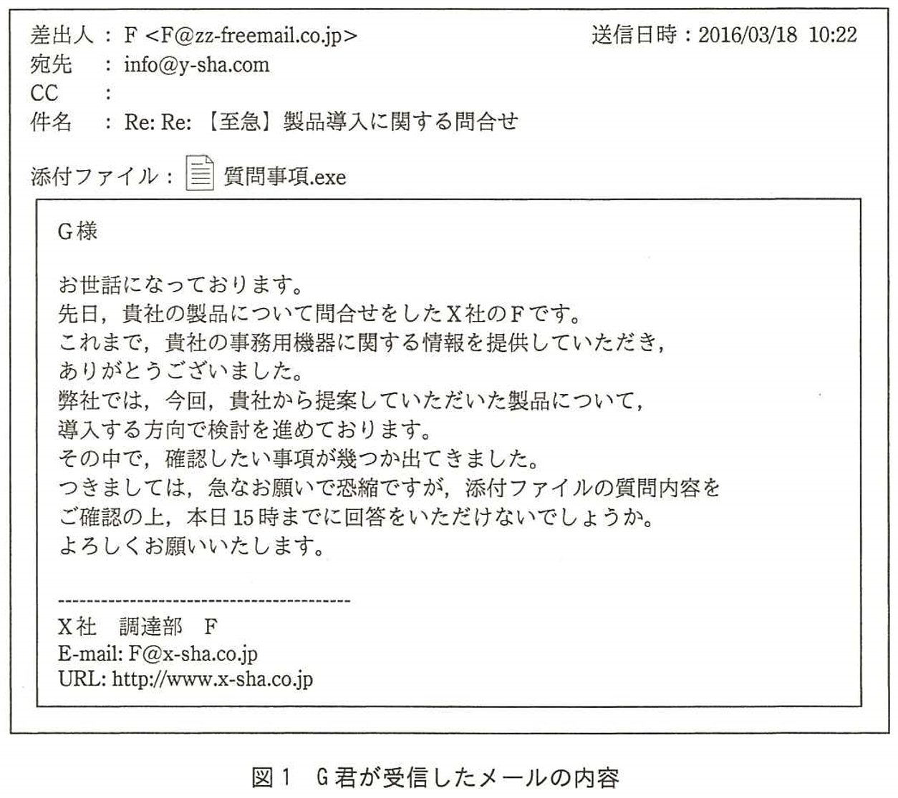
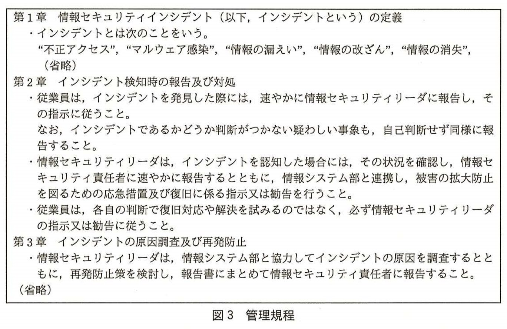
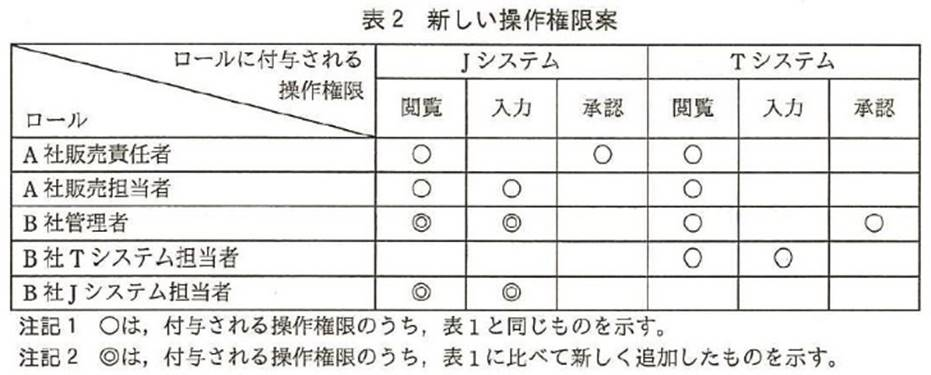
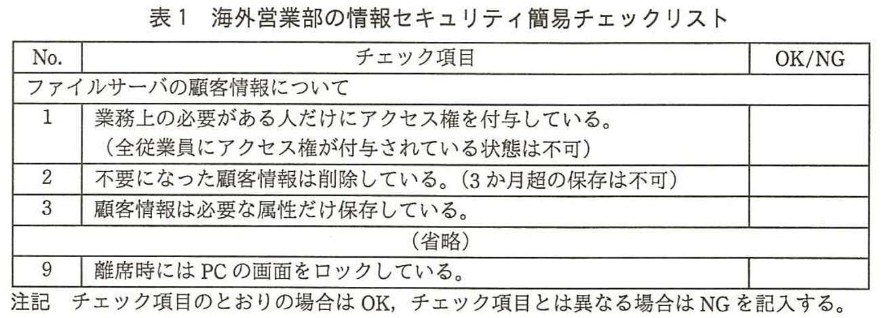
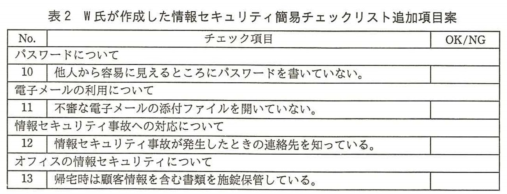
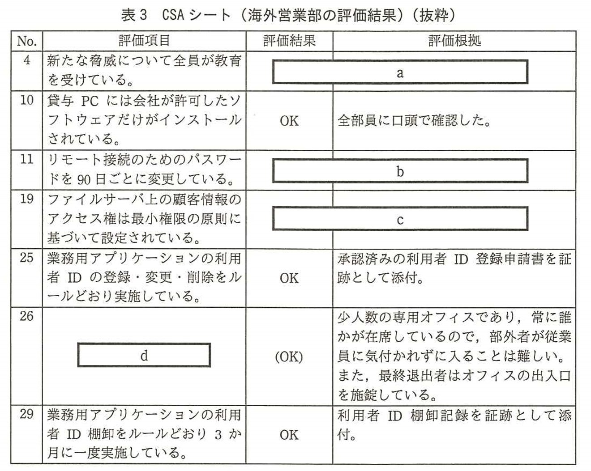

# 第15章　第１回試験（平成28年＝2016年春）午後問題と解説  

#### 本章について

2016年春，情報処理技術者試験センターは１回目の情報セキュリティマネジメント試験の開催後，試験問題（午前50問，午後3問）と解答，採点講評を公開しました．本章では午後問題の全問題文とオリジナル解説を掲載します．キーワードには本書第1～11章の該当項目番号を付記してありますので，理解不足の単語があればしっかりチェックすることをお勧めします．

なお，出題分野は３問とも「情報セキュリティ」となっています．午前問題とは異なり，他の試験区分の問題の流用はありません．問題文が非常に長いので（基本情報をはるかに上回っています），過去問を用いた長文読解の練習をしておくことをお勧めします．

## 15.1　問１　標的型攻撃メールの脅威と対策

**問１**　標的型攻撃メールの脅威と対策に関する次の記述を読んで，設問1，2に答えよ．

　Ｙ社は，事務用機器を主力商品とする販売代理店である．従業員数は1,200名であり，本社には営業部，情報システム部，総務部などがある．

〔PCのマルウェア感染〕

　ある日，情報システム部は，Ｙ社内の1台のPCが大量の不審なパケットを発信していることをネットワーク監視作業中に発見し，直ちに外部との接続を遮断した．

　情報システム部による調査の結果，営業部に所属する若手従業員Ｇ君が，受信した電子メール(以下，電子メールをメールという)の添付ファイルを開封したことが原因で，Ｇ君のPCがマルウェアに感染し，大量のパケットを発信していたことが判明した．幸いにも，情報システム部の迅速な対処によって，顧客情報の漏えいなどの最悪の事態は防ぐことができた．

〔受信したメール〕

　情報システム部のＳ主任は，営業部の情報セキュリティリーダであるＥ課長に，今回の事態に関する調査結果を報告した．次は，その時の会話である．

|   |   |
|:--|:--|
| Ｓ主任：| Ｇ君が受信したメールは，いわゆる標的型攻撃メールと呼ばれるものです．標的型攻撃メールとは， ~~ａ~~ の組織や個人を対象として，受信者のPCにマルウェアを送りつけ，情報を窃取することなどを目的とするメールであり，~~ｂ~~ の組織や個人を対象として送られるウイルスメールとは異なるものです．|
| Ｅ課長：| 最近は国内でも標的型攻撃メールに起因する情報漏えい事故が多数発生しており，大手企業や官公庁以外もターゲットになり得るので，営業部の従業員には十分に注意するよう言っていたのだが．|
| Ｓ主任：| 標的型攻撃メールでは，注意していたつもりでも，気付かずにマルウェア感染が起こります．また，受信者が疑いをもたないように，メールの差出人を公的機関などに詐称したり，メールの件名や内容を受信者の業務に関連したものに偽装したりするといった，　 ~~ｃ~~ を利用します．|
| Ｅ課長：| Ｇ君が受信したメールを具体的に説明してくれるかな．|
| Ｓ主任：| メールの内容を図1に示します．この内容から，<u>①受信者の疑いを低減させる手口や，受信者の動作を巧みに誘導する手口</u>などが見受けられます．|

　Ｓ主任は，<u>②標的型攻撃メールによく見られる注意すべき特徴のうち，Ｇ君が受信したメールに見られる特徴</u>を説明した．

〔ヒアリング〕

　Ｓ主任からの調査報告を受けたＥ課長は，Ｇ君に対して，このメールを受信した際の状況及び対応に関してヒアリングをした．また，Ｙ社の情報セキュリティインシデント管理規程(以下，管理規程という)どおりには対応しなかった理由をＧ君に確認した．

　Ｅ課長がまとめたヒアリング結果を図2に，Ｙ社の管理規程を図3に示す．

- Ｘ社は過去に取引がある会社であった．
- Ｆ氏と直接会ったことは無かったが，10日前から，製品の問合せが3回あり，メールでやり取りをしていた．
- メールの添付ファイルを開封した際は，見慣れないウィンドウが表示されただけでドキュメントは開くことができなかった．そこで，ファイルを再送してほしい旨を先方にメールで返信したが，15時までと急いでいた割にその後の返信が無く不審に思った．再度連絡しようと思っていたが，別件で多忙になり，確認ができなかった．
- その後，PCの処理速度が遅くなったり．見慣れないウィンドウが表示されたりするなどの不具合や不審な事象が発生していたが，その都度，PCを再起動するなどして解決を試みた．また，ウイルス対策ソフトが動作し，バターンファイルが最新になっていることを確認できたのでマルウェア感染はあり得ないだろうと考え，誰にも相談せず，報告もしなかった．
- 以前に他の部のＨ君が，顧客から貸与されたUSBメモリをPCに接続してマルウェア感染が起きたことを上司に報告した際に，上司から大変厳しく叱責されたとＨ君本人から聞いていたので．マルウェア感染と確信できない限りは，報告したくないと思っていた．
- 管理規程については，新入社員研修の際に一度見たことがある程度で，重要な規程とは思っていなかった．
- 標的型攻撃メールについては，聞いたことはあったが理解はしていなかった．

図2　Ｇ君へのヒアリング結果

〔情報セキュリティ意識向上に向けて〕

　次は，ヒアリング実施後のＥ課長とＳ主任との会話である．

|   |   |
|:--|:--|
| Ｓ主任：| 標的型攻撃メールによるマルウェア感染を完全に防ぐことは難しいので，被害を最小化するためには，メールの添付ファイルを開封した後に従業員が適切な対応を取ることが重要になります．|
| Ｅ課長：| そうだね．<u>③今回の初動対応における問題点は二つあった</u>と思う．本来であれば，管理規程に基づき，疑わしい事象を発見した従業員は， ~~ｄ~~ に報告をしなければならない．また，報告に当たっては， ~~ｅ~~ 報告することも重要だ．|
| Ｓ主任：| おっしゃるとおりです．今回の問題点を解決するには，規程やルールは単に策定しただけでは不十分であり，それらが順守されるように ~~f1~~ ， ~~f2~~ の2点を行うことが重要だと考えられます．|
| Ｅ課長：| 今回のような標的型攻撃メールなどへの対策に当たっては，従業員一人一人の情報セキュリティ意識を向上させる地道な活動が必要だと思う．まずは，<u>④実際に攻撃を受けた場合にも一人一人が適切に対応できるかを定量的に測定し評価できるようにしていきたい</u>．そのための全社的な取組みも情報システム部で実施してもらえないだろうか．|
| Ｓ主任：| 承知いたしました．検討し実施したいと思います．|

　Ｅ課長からの提案もあって，Ｙ社では，従業員の情報セキュリティ意識向上に着実に取り組むようになった．

**解説**

　採点講評にある通り，**標的型攻撃**（1.1.9参照）のような，技術的対策だけでは防ぎきれない脅威に対する，情報セキュリティリーダの役割を問う問題です．関連規程の順守状況の改善，情報セキュリティの円滑な運用に加えて，職場の情報セキュリティ文化を醸成すること等があります．

**設問１**〔受信したメール〕について，(1)～(4)に答えよ．

**(1)** 本文中の ~~ａ~~ と ~~ｂ~~ に入れる字句はどれか．解答群のうち，最も適切なものを選べ．

a，b に関する解答群

|    |    |    |    |    |    |
|:---|:---|:---|:---|:---|:---|
| ア | 海外 | イ | 架空 | ウ | 官界 |
| エ | 国内 | オ | 大企業 | カ | 中小企業 |
| キ | 特定 | ク | 不特定多数 | ケ | 民間 |

**正解：ａ－キ，ｂ－ク**

標的型攻撃は相手の種別ではなく相手そのものをピンポイントで狙うのが特徴です．よって，空欄ａは「標的型攻撃メールとは，『特定』の組織や個人を対象として，受信者のPCにマルウェアを送りつけ，情報を窃取することなどを目的とするメールであり」となります．

次に，主なウイルスメールはコンピュータウイルスの拡散が目的なので相手を特定しない配信が特徴です．よって，空欄ｂは「『不特定多数』の組織や個人を対象として送られるウイルスメールとは異なる」となります．

なお，標的型攻撃やウイルスメールにおいて，海外か国内かの区別，官界か民間かの区別，企業の規模の区別をするとは限りませんので，ア，ウ，エ，オ，カ，ケは該当しません．

また，標的型攻撃やウイルスメールにおいて，架空の送信元アドレスを用いることはありますが，送信先は実在しないと意味がありませんので，イは該当しません．

**(2)** 本文中の ~~ｃ~~ に入れる字句はどれか．解答群のうち，最も適切なものを選べ．

c に関する解答群

|    |    |    |    |
|:---|:---|:---|:---|
| ア | AES | イ |ゼロデイ攻撃 |
| ウ | ソーシャルエンジニアリング | エ | トロイの木馬 |
| オ | ヒヤリハット | カ | ブルートフォース攻撃 |

**正解：ｃ－ウ**

「メールの件名や内容を受信者の業務に関連したものに偽装したりするといった」手口は人間的な弱点をつく攻撃なので **ソーシャルエンジニアリング**（1.1.3参照）に分類されます．

アの **AES（Advanced Encryption Standard）**（1.1.10参照）は共通鍵暗号方式のアルゴリズムの一つ．

イの **ゼロデイ攻撃**（1.1.9参照）はサイバー攻撃手法の一種．

エの **トロイの木馬**（1.1.4参照）はマルウェアの一種．

オの **ヒヤリハット**（7.3.6参照）はインシデント及びサービス要求管理の対象．

カの **ブルートフォース攻撃**（1.1.9参照）はサイバー攻撃手法の一種で総当たり攻撃ともいいます．

**(3)** 本文中の下線①について，今回の攻撃者が使った手口として考えられるものを<u>二つ</u>，解答群の中から選べ．

解答群

|   |   |
|:--|:--|
| ア | 製品を導入する方向で検討を進めているという趣旨を伝えた上で，質問の回答期限を指定することによって添付ファイルを開くよう誘導している．|
| イ | メールの本文にＹ社の従業員しか知リ得ない情報を記載することによって疑いを低減している．|
| ウ | メールの本文に正当なURLを装ったリンクを記載した上で，そのURLリンクをクリックするよう指示し，誘導している．|
| エ | メールのやり取りを数回行うことによって疑いを低減している．|

**正解：ア，エ**

アは，メール本文で「導入する方向で検討」「本日15時までに回答を」とあるので該当します．

イは，メール本文に「Ｙ社の従業員しか知リ得ない情報」に該当する記述がありません．

ウは，メール本文に「正当なURLを装ったリンク」や「そのURLリンクをクリックする指示」に該当する記述がありません．本文ではなく，フッターにＸ社のURLがありますが，これをクリックする指示はありません．

エは，メールの件名が「Re:Re:」となっており，本文で「先日…問合せをした」とあるので該当します．また，ヒアリングでも「10日前から，製品の問合せが3回あり，メールでやり取り」したとあります．

**(4)** 本文中の下線②について，次の(ⅰ)～(ⅲ)のうち，Ｇ君が受信したメールに見られる特徴だけを全て挙げた組合せを，解答群の中から選べ．

|   |   |
|:--|:--|
| (ⅰ) | 差出人のメールアドレスがＹ社の社内メールアドレスに詐称されている．|
| (ⅱ) | 差出人のメールアドレスと，本文の末尾に記載された署名のメールアドレスが異なる．|
| (ⅲ) | 実行形式ファイルが添付されている．|

解答群

|    |    |    |    |    |    |
|:---|:---|:---|:---|:---|:---|
| ア | (ⅰ) | イ | (ⅰ)，(ⅱ) | ウ | (ⅰ)，(ⅱ)，(ⅲ) |
| エ | (ⅰ)，(ⅲ) | オ | (ⅱ) | カ | (ⅱ)，(ⅲ) |
| キ | (ⅲ) |

**正解：カ**

図１で差出人のメールアドレスが「F@zz-freemail.co.jp」なので(ⅰ)は当てはまりません．

図１で差出人のメールアドレスが「F@zz-freemail.co.jp」にも関わらず，フッターのアドレスが「F@x-sha.co.jp」になっているので，(ⅱ)に該当します．

図１で添付ファイル「質問事項.exe」は拡張子が「.exe」の実行形式なので(ⅲ)に該当します．

**設問２**〔情報セキュリティ意識向上に向けて〕について，(1)～(5)に答えよ．

**(1)** 本文中の下線③について，次の(ⅰ)～(ⅳ)のうち，今回の初動対応における問題点を二つ挙げた組合せを，解答群の中から選べ．

|   |   |
|:--|:--|
| (ⅰ) | PCの不具合に気付いても直ちに再インストールなどの復旧対応を行わなかった点 |
| (ⅱ) | 問合せ対応を行うに当たって，Ｘ社との最近の取引記録を確認しなかった点 |
| (ⅲ) | 不審な事象が起きたにもかかわらず，情報セキュリティリーダに報告しなかった点 |
| (ⅳ) | 不審な事象が起きたにもかかわらず，マルウェアには感染していないと自己判断した点 |

解答群

|    |    |    |    |    |    |
|:---|:---|:---|:---|:---|:---|
| ア | (ⅰ)，(ⅱ) | イ | (ⅰ)，(ⅲ) | ウ | (ⅰ)，(ⅱ)，(ⅲ) |
| エ | (ⅱ)，(ⅲ) | オ | (ⅱ)，(ⅳ) | カ | (ⅲ)，(ⅳ) |

**正解：カ**

(ⅰ)は図３の管理規定にない行為なので当てはまりません．

(ⅱ)は与信管理の項目で，セキュリティの初動対応には当てはまりません．

図２の４項目の「誰にも相談せず，報告もしなかった」が(ⅲ)に該当します．

図２の４項目の「マルウェア感染はあり得ないだろうと考え」が(ⅳ)に該当します．

**(2)** 本文中の ~~ｄ~~ に入れる字句はどれか．解答群のうち，最も適切なものを選べ．

d に関する解答群

|   |   |
|:--|:--|
| ア | インシデントであると判断した後 |
| イ | 原因調査後 |
| ウ | 再発防止策を検討した後 |
| エ | 速やか |

**正解：エ**

図３の第２章の１項目の「速やかに」が該当します．

アのインシデントかどうかの判断に時間をかけるべきではありません．

イの原因調査はインシデントへの対処後に行います．

ウの再発防止策の検討は対処の完了後に行うものです．

**(3)** 本文中の ~~ｅ~~ に入れる字句はどれか．解答群のうち，最も適切なものを選べ．

e に関する解答群

|   |   |
|:--|:--|
| ア | 誤った報告を行わないよう，事象をインターネットや書籍などで確認して，類似の事例が確認できたものを |
| イ | 判断に迷う事象であっても自己判断せずに |
| ウ | 部内の同僚と相談してから，報告するように勧められた事象を |
| エ | 報告事項がそろうのを待って，レポートにまとめたものを |

**正解：イ**

図３の第２章の１項目の「自己判断せず」が該当します．

アは類似の事例があるとは限らず，インターネット上で正しい情報が得られるとも限りません．

ウは同僚から正しい情報が得られるとは限りません．

エは発見者が報告事項をレポートにまとめる義務はありません．

**(4)** 本文中の ~~f1~~ ， ~~f2~~ に入れる，次の(ⅰ)～(ⅳ)の組合せはどれか．fに関する解答群のうち，最も適切なものを選べ．

|   |   |
|:--|:--|
| (ⅰ) | 管理規程の内容に関する従業員への周知 |
| (ⅱ) | 情報共有や報告が包み隠さず行われるような組織文化の醸成 |
| (ⅲ) | 情報セキュリティにおけるクラッキング手法の教育 |
| (ⅳ) | マルウェア感染時の迅速な復旧対応方法の指導 |

f に関する解答群

|   | f1 | f2 |
|:--|:--|:--|
| ア | (ⅰ) | (ⅱ) |
| イ | (ⅰ) | (ⅲ) |
| ウ | (ⅰ) | (ⅳ) |
| エ | (ⅱ) | (ⅲ) |
| オ | (ⅱ) | (ⅳ) |
| カ | (ⅲ) | (ⅳ) |

**正解：ア**

「今回の問題点を解決するには，規程やルールは単に策定しただけでは不十分であり，それらが順守されるように『管理規程の内容に関する従業員への周知』『情報共有や報告が包み隠さず行われるような組織文化の醸成』の2点を行うことが重要だと考えられます」となります．

(ⅰ) 図２の第６項目の「管理規定は…重要な規定とは思ってなかった」ということから，管理規定の周知が必要だと分りますので該当します．

(ⅱ) 図２の第５項目の「厳しく叱責された」「確信できない限りは報告したくない」から，組織文化に問題があると分りますので該当します．

(ⅲ) 図２の各項目とクラッキング(不正攻撃)手法の教育は特に関連しません．

(ⅳ) 図２の各項目と復旧対応方法の指導は特に関連しません．

**(5)** 本文中の下線④について，Ｅ課長の提案に応える取組みはどれか．解答群のうち，最も適切なものを選べ．

解答群

|   |   |
|:--|:--|
| ア | 標的型攻撃メールについて，従業員のPCがマルウェア感染しないために注意すべき事項を標語として作成して掲示する．|
| イ | 標的型攻撃メールへの対策を題材とするDVD上映会を年に2回開催し，従業員の出席率を確認する．|
| ウ | 標的型攻撃メールを起因とするインシデントについて，他社で発生した事例を月に1回，イントラネット上の掲示板で紹介する．|
| エ | 模擬の標的型攻撃メールを従業員に期間を空けて何回か送付し，添付ファイル開封後の報告完了率，報告完了までに要した時間などの変化を調査する．|

**正解：エ**

下線部④「<u>実際に攻撃を受けた場合にも一人一人が適切に対応できるかを定量的に測定し評価できるようにしていきたい</u>」の「定量的」とは数値化し，値やその変化を明示できることです．「報告完了率，報告完了までに要した時間などの変化を調査する」ことが当てはまります．

アとウは啓蒙行為であり結果は定性的にしか得られないので該当しません．

イは出席率が得られますが，出席しても理解したとは限りませんので，測定値としては用いられませんので不適切です．

## 15.2　問２　業務委託におけるアクセス制御

**問２**　業務委託におけるアクセス制御に関する次の記述を読んで，設問１，２に答えよ．

　Ａ社は従業員数200名の通信販売業者である．一般消費者向けに生活雑貨，ギフト商品などの販売を手掛けており，商品の種類ごとに販売課が編成されている．

〔Ｚ販売課の業務〕

　現在，Ｚ販売課は，商品Ｚについて顧客から電子メール又はファックスによる注文及び問合せを受け，その対応を行っている．商品Ｚの販売に関わる要員(以下，商品Ｚ関連要員という)は，販売責任者であるＺ販売課Ｎ課長，及びその管理下に５名の担当者，並びに業務委託先の管理者であるＢ社運用課Ｌ課長，及びその管理下に８名の担当者の，計15名で構成されている．商品Ｚ関連要員の業務を図１に示す．

|  |
|:--|
| 1．受注管理業務 　顧客から届く注文を確認し，受注手続を行う．受注管理システム（以下．Ｊシステムという）を利用する．本業務は，Ａ社のＺ販売課の要員が担当する． （1）入力   担当者は，届いた注文（変更，キャンセルを含む）の内容を確認し，不備があれば顧客に問い合わせる．不備がなければその情報をＪシステムに入力し．販売責任者に承認を依頼する． （2）承認  　販売費任者は，注文の内容とＪシステムヘの入力結果を突き合わせて確認し，問題がなければ承認する．問題があれば差し戻す． 2．問合せ対応業務  　顧客からの問合せに対応する．問合せ管理システム（以下．Ｔシステムという）を利用する．本業務は，業務委託先であるＢ社の運用課の要員が担当する．  （1）入力  　担当者は，顧客から届いた問合せの内容を確認し，回答案をＴシステムに入力して，管理者に承認を依頼する．  （2）承認  　管理者は，回答案を確認し，問題がなければ承認する．これによってＴシステムから顧客に回答が返信される．問題があればコメントを付記して差し戻す．  補足：Ｊシステム及びＴシステムはＡ社の情報システム部が運用している．|

図１　商品Ｚ関連要員の業務（概要）

　Ｂ社は，自社内にＡ社からの受託業務専用のオペレーションルームをもち，そこからＡ社のＴシステムにアクセスしている．Ｂ社は，Ａ社からの受託業務に必要な設備及び管理体制を整えており，Ａ社が定める情報セキュリティ要件を満たしている．

〔Ｊシステム及びＴシステムの操作権限〕

　Ｚ販売課では，Ｊシステム及びTシステムについて，次の利用方針を定めている．

[方針1]　１人の利用者に，一つの利用者IDを登録する．  
[方針2]　一つの利用者IDは，１人の利用者だけが利用する．  
[方針3]　ある利用者が入力した情報は，別の利用者が承認する．  
[方針4]　販売責任者は，Ｚ販売課の全業務の情報を閲覧できる．

　Ｊシステム及びＴシステムでは，業務上必要な操作権限を利用者に与えるためにシステム上の役割(以下，ロールという)を定義する機能が実装されている．ロールには，業務上必要な操作権限の組合せが付与される．利用者IDにロールを設定することによって，利用者の操作権限が決まる．一つの利用者IDにはロールを一つだけ設定する．システム利用部署の長は，所属する利用者の利用者IDに対するロール設定を情報システム部に依頼する．情報システム部が受けた依頼はシステムに登録され，翌営業日の朝５時に自動的にシステムに反映される．

　Ｊシステム及びＴシステムにおいて，商品Ｚ関連要員の利用者IDに設定されているロールの種類とその操作権限を表１に示す．

　例えば，Ｎ課長の利用者IDには'Ａ社販売責任者'というロールを設定して，Ｊシステムの閲覧及び承認並びにＴシステムの閲覧の権限をもたせている．

〔受注管理業務の委託〕

　Ｚ販売課では，受注管理業務を担当するＡ社の従業員の作業量が受注増によって増えていることから，この業務の入力作業をＢ社に対して追加で委託することにした．追加の業務委託で必要となるＪシステムの操作権限の見直しを，Ａ社の販売課全体の情報セキュリティリーダを務める販売管理課のＭ主任が支援することになった．

　Ｍ主任は，受注管理業務におけるＡ社とＢ社の役割分担について，Ｚ販売課のＮ課長からヒアリングした内容を次のとおり整理した．

[要求1]　Ｂ社が入力した場合は，Ａ社が承認する．  
[要求2]　Ａ社の担当者が入力した場合は，現状どおりにＡ社の販売責任者が承認する．

　これに基づきM主任が作成した新しい操作権限案を表２に示す．

　次は，この操作権限案についてのＭ主任とＮ課長との会話である．

|    |    |
|:---|:---|
| Ｍ主任：| Ｎ課長の要求に従ってロールとその操作権限を見直してみました．|
| Ｎ課長：| 確かに，要求どおりだ．ただ，販売責任者は私だけなので業務が停滞することが心配だ．Ｂ社で入力した情報はＡ社の担当者が承認すればよいので，'Ａ社販売担当者'ロールに承認権限を追加できないだろうか．|
| Ｍ主任：| 承認権限を追加すると，<u>①Ｊシステムで利用方針に違反してしまいます</u>．|
| Ｎ課長：| 'Ａ社販売担当者'ロールに承認権限を追加し，その上で，利用方針にも合うようにしたい．例えば ~~ａ~~ ことはできるだろうか．|
| Ｍ主任：| それならば，利用方針は順守できそうです．ただ，システムの改修が必要ですね．また，<u>②[要求2]を満たせません</u>．別の案ですが， ~~ｂ~~ ようにシステム改修するのはどうでしょう．|
| Ｎ課長：|確かに，それなら[要求2]も満たせる．早速，その方針で情報システム部にシステム改修の相談をしてくれないか．|
| Ｍ主任：| 承知しました．確認ですが，Ｎ課長は，出張などで承認手続ができなくなるようなケースはありませんか．|
| Ｎ課長：| 今のところ問題ない．ただ，<u>③来年度から毎年2，3回，2週間ほどの海外出張に出る予定なので，誰かに代行してもらう必要が出てくる</u>．この対応も検討したい．それと，Ｂ社のＬ課長からの話だが，一日の中でも問合せ数が少ない時間に，問合せ対応業務の担当者の一部が受注管理業務を応援できる運用を希望していたよ．あらかじめ担当者を任命して教育もしておくそうだ．|
| Ｍ主任：|承知しました．すぐにＢ社に詳細を確認して<u>④必要な操作権限を与える方法を検討します</u>．|

　Ｍ主任は，Ｂ社の管理者及びＡ社の情報システム部と調整して，Ｎ課長とともにＪシステムの改修案，運用案を取りまとめた．

〔Ｂ社担当者の追加及び変更〕

　Ａ社情報システム部では，社内データベースに格納された情報を閲覧するための情報閲覧システム(以下，Ｄシステムという)を提供している．Ｄシステムで商品Ｚ関連要員に付与されている閲覧権限を表３に示す．

　なお，利用者IDは，Ｊシステム及びＴシステムと共通である．

表３　商品Ｚ関連要員に付与されている閲覧権限（抜粋）

| 情報のオーナ部署| 情報| …| Ａ社Ｚ販売部の要員| Ｂ社運用課の要員|
|:--|:--|:--|:--|:--|
| 販売管理課| 在庫情報| …| ○| ○|
| 販売管理課| 販売情報・実績情報| …| ○| |
| サービス企画課| お客様情報| …| ○| ○|
| 商品企画課| 商品カタログ情報| …| ○| ○|
| 商品企画課| 問合せ履歴情報| …| ○| ○|

注記　○は権限が付与されていることを示す．

　Ａ社では，Ｄシステムの閲覧権限の付与について，次の手続を定めている．

|  |  |
|:--|:--|
| (1)| 各情報のオーナ部署の長が，閲覧権限を付与する対象者を決める．|
| (2)| 情報システム部は，情報のオーナ部署の長の決定に従ってＤシステムの閲覧権限を設定する．|
| (3)| 利用部署の希望によって閲覧権限を付与する場合は，利用部署の長が，その情報のオーナ部署の長に申請して承認を得る．申請を承認した情報のオーナ部署の長は，情報システム部に対して閲覧権限の付与を依頼する．|
| (4)| 利用部署が，業務委託先要員への閲覧権限付与を希望する場合は， ~~ｃ~~ ．

　次は，Ｂ社の担当者の追加及び変更に関する，Ｍ主任とＮ課長の会話である．

|  |  |
|:--|:--|
| Ｍ主任：| 新しく追加されるＢ社Ｊシステム担当者に付与する閲覧権限について相談があります． ~~ｄ~~ のリスクを低減するために，表3に示すＤシステムの閲覧権限を見直して，必要最小限にした方がよいと思います．|
| Ｎ課長：| Ｊシステム担当者の作業は，届いた注文の確認と入力だ．商品カタログ情報とお客様情報の閲覧だけだな．|
| Ｍ主任：| では，Ｎ課長から ~~ｅ~~ に対して，閲覧権限の付与を申請していただけますか．|
| Ｎ課長：| 新しいＢ社担当者の名簿はできているかな．|
| Ｍ主任：| はい．Ｂ社から情報を受領しました．Ｊシステム担当者は３名です．|
| Ｎ課長：| Ｔシステム担当者に変更はないかな．|
| Ｍ主任：| あります．<u>⑤来月中に1人が退任し1人が新規に着任する</u>と聞きました．引継ぎを兼ねて，おおよそ１週間は２人とも在籍してＴシステムとＤシステムを利用して業務を行う予定です．必要な権限を正しくシステムに登録するために，Ｂ社に担当者変更がある場合，原則２週間前に ~~ｆ~~ から情報提供してもらうよう業務委託契約で定めています．後ほど，<u>⑥正式に情報を受領します</u>．|
| Ｎ課長：| 分かった．今回，業務委託の対象システムも人員も増えるので，改めて情報漏えい対策に力を入れていきたい．頼りにしているよ．|

　こうしてＮ課長とＭ主任は必要な準備を進め，新しい体制で業務を開始することができた．

**解説**

　採点講評にある通り，この問題は業務の一部を外部委託する状況での情報システムにおける **ロールベースアクセス制御（RBAC：Role-based Access Control）**（4.1.2参照）がテーマです．

**設問１**　〔受注管理業務の委託〕について，(1)～(6)に答えよ．

**(1)** 本文中の下線①について，どの利用方針に違反するか．違反が考えられる利用方針だけを全て挙げた組合せを，解答群の中から選べ．

解答群

|  |  |  |  |
|:--|:--|:--|:--|
| ア| [方針１]| イ| [方針１]，[方針２]|
| ウ| [方針２]| エ| [方針２]，[方針３]|
| オ| [方針３]| カ| [方針３]，[方針４]|

**正解：オ**

**ロール**（4.1.2参照）は問題文中の説明のとおり，権限のセットに名前をつけたものです．「Ａ社販売担当者」ロールに承認権限を追加した場合に，４つの方針に違反するかを順にチェックします．

方針１は「１利用者１ID」ですので，承認権限の追加とは無関係です．

方針２は「１ID１利用者」ですので，承認権限の追加とは無関係です．

方針３は「入力権と承認権の同時付与禁止」ですので，承認権限を追加すると違反します．

方針４は「販売責任者の全閲覧権限」ですので，承認権限の追加とは無関係です．

以上から，方針３のみに違反すると分ります．

**(2)** 本文中の下線①について，この利用方針違反はどのリスクを高めると考えられるか．解答群のうち，最も適切なものを選べ．

解答群

| | |
|:---|:---|
| ア | 正しく入力された注文が承認されず滞留してしまう．|
| イ | 正しく入力された注文の情報が窃取されてしまう．|
| ウ | 不正に入力された注文が差し戻されて滞留してしまう．|
| エ | 不正に入力された注文が承認されてしまう．|

**正解：エ**

前問のとおり，下線①の「承認権限を追加」は「入力権と承認権の同時付与禁止」に違反します．

よって，販売担当者が入力し，入力した本人が承認できてしまいますので，エの「不正入力された注文の承認」のリスクが高まることがわかります．

アの「承認待ちの滞留」，イの「情報の窃取」，ウの「不正注文の差し戻しによる滞留」は「承認権限の追加」とは無関係です．

**(3)** 本文中の ~~ａ~~ ， ~~ｂ~~ に入れる適切な字句を，解答群の中から選べ．

a，b に関する解答群

| | |
|:---|:---|
| ア | 'Ａ社販売責任者'ロールを設定した利用者IDを二つに増やす |
| イ | 'Ｂ社Ｊシステム担当者'ロール又は'Ｂ社管理者'ロールを使って入力された注文だけを承認できる権限を追加する |
| ウ | 自分が承認したい注文だけを検索できる機能を追加する |
| エ | 承認できる利用者IDを，入力者が指定する権限を追加する |
| オ | 他の利用者IDによって入力された注文だけを承認できる権限を追加する |

**正解：ａーオ，ｂ－イ**

空欄ａと空欄ｂには[要求1]の「Ｂ社が入力した場合は，Ａ社が承認する」を解決できて，利用方針が順守できるものが入ります．

そのうち，空欄ａには[要求2]の「Ａ社の担当者が入力した場合は，現状どおりにＡ社の販売責任者が承認する」を解決できないものが，空欄ｂには解決できるものが該当します．

アは'Ａ社販売責任者'ロールを持つ利用者IDを増やすだけであり，業務の停滞を解決できる可能性がありますが，[要求1]の解決にも[要求2]の解決にもなりません．

イは新たに追加した権限を'Ａ社販売担当者'ロールに追加することで，Ｂ社社員が入力した注文を'Ａ社販売責任者'ロールを持つＡ社員が承認できるようになりますので，[要求1]の解決になります．また，現状の「Ａ社担当者が入力した注文をＡ社の販売責任者が承認する」ことには影響を与えませんので[要求2]の解決にもなります．よって，空欄ｂに当てはまります．

ウは検索機能の追加のみであり，[要求1]の解決にも[要求2]の解決にもなりません．

エはＢ社の入力者が承認者にＡ社の利用者IDを指定することで [要求1]の「Ｂ社が入力した場合は，Ａ社が承認する」を解決できますが，入力者側に権限があるため，指定を誤ったり故意に不正な指定をすることが避けられません．よって，[要求1]の解決にも[要求2]の解決にもなりません．

オは前問の「入力権と承認権の同時付与禁止」を防止できるので，この権限を'Ａ社販売担当者'ロールに設定して[要求1]の解決が可能です．しかし，Ａ社の担当者の１人が入力した場合に，Ａ社の販売責任者に加えてもう一人の担当者が承認できてしまうため[要求2]の解決にはなりません．よって，空欄ａに当てはまります．

**(4)** 文中の下線②について，なぜ ~~ａ~~ では[要求2]を満たせないのか．その理由を，解答群の中から選べ．ここで， ~~ａ~~ には正しい答えが入っているものとする．

解答群

| | |
|:---|:---|
| ア | 'Ａ社販売責任者'ロールの利用者が，Ｂ社で入力された情報を承認できなくなるから．|
| イ | 'Ａ社販売責任者'ロールの利用者が，自分宛ての承認依頼に気づくとは限らないから．|
| ウ | 'Ａ社販売担当者'ロールの利用者が複数人いるとき，１人が入力し，別の１人が承認することができるから．|
| エ | 'Ｂ社管理者'ロールの利用者が承認権限をもっているから．|

**正解：ウ**

前問で検討した通り，他の利用者IDによって入力された注文だけを承認できる権限を'Ａ社販売担当者'ロールに設定すると，Ａ社の担当者の１人が入力した場合に，Ａ社の販売責任者に加えてもう一人の担当者が承認できてしまうため[要求2]の解決にはなりません．よって，ウが適切です．

この設定は'Ａ社販売責任者'ロールの利用者には無関係ですので，アとイは不適切です．

また，'Ｂ社管理者'ロールの利用者にも無関係ですので，エは不適切です．

**(5)** 本文中の下線③について，Ｎ課長が出張中に他の者が代行するための措置のうち，利用方針に合致するものを，解答群の中から選べ．

解答群

| | |
|:---|:---|
| ア | 'Ａ社販売責任者'ロールを設定した利用者IDを一つ追加発行し，Ａ社の担当者の1人が，代行者として利用する．|
| イ | Ａ社の担当者の1人を代行者に任命し，'Ａ社販売責任者'ロールの権限を追加で付与した新しいロールを作成して，代行者の利用者IDに設定する．|
| ウ | Ｎ課長が，出張の期間に限り，自分の利用者ID，パスワードを別の販売課の課長に貸す．|
| エ | Ｎ課長の上長に代行を依頼し，代行者の利用者IDをＪシステム及びＴシステムに登録して'Ａ社販売責任者'ロールを設定する．|

**正解：エ**

エの「上長が代行」はどの利用方針にも合致しますので適切です．

アは担当者が２つのIDを持ってしまうので方針１「１利用者１ID」に抵触します．

イは代行者が入力権と承認権を持ってしまうので方針３「入力権と承認権の同時付与禁止」に抵触します．

ウは販売課長がＮ課長のIDを利用するので方針２「１ID１利用者」に抵触します．

**(6)** 本文中の下線④について，情報システム部に依頼して必要な操作権限を与える方法はどれか．解答群のうち，最も適切なものを選べ．ここで，応援に回すＢ社担当者をＢ社応援担当者という．

解答群

| | |
|:---|:---|
| ア | 'Ｂ社Ｊシステム担当者'ロールを設定した貸出し用の利用者IDを準備し，応援の都度，Ｂ社応援担当者にこの利用者IDを利用させる．|
| イ | 'Ｂ社Ｔシステム担当者'ロールの権限と'Ｂ社Ｊシステム担当者'ロールの権限を併せ持つ新しいロールを定義し，Ｂ社応援担当者の利用者IDに設定しておく．|
| ウ | Ｂ社応援担当者の利用者IDに対して'Ｂ社管理者'のロールを設定しておく．|
| エ | 応援の都度，Ｂ社応援担当者の利用者IDに設定されたロールを'Ｂ社Ｊシステム担当者'に切り替えてもらう．|

**正解：イ**

イの「'Ｂ社Ｔシステム担当者'ロールの権限と'Ｂ社Ｔシステム担当者'ロールの権限を併せ持つ新しいロール」であれば，ＴシステムとＪシステムの両方について閲覧と入力が可能であり，これをＢ社応援担当者の利用者IDに設定するだけでよいので，最も適切です．

アは利用者IDの貸出であり方針２「１ID１利用者」に抵触します．

ウはＢ社担当者が承認権を持ってしまうので方針３「入力権と承認権の同時付与禁止」に抵触します．

エは方針には抵触しませんが，都度切り替えることはトラブルの原因になりやすいので最も適切とはいえません．

**設問２**　〔Ｂ社担当者の追加及び変更〕について，(1)～(4)に答えよ．

**(1)** 本文中の ~~ｃ~~ に入れる字句はどれか．解答群のうち，最も適切なものを選べ．

ｃに関する解答群

| | |
|:---|:---|
| ア | 業務委託先の管理者が，利用部署の長に名簿を提出するとともに，情報のオーナ部署の長に申請する．|
| イ | 業務委託先の従業員が，利用部署の長に申請し，利用部署の長が，情報のオーナ部署の長に申請する．|
| ウ | 利用部署の長が，業務委託先から提出された申請書を情報のオーナ部署の長に転送する．|
| エ | 利用部署の長が，業務委託先の管理者から提出された利用者の情報に基づき，情報のオーナ部署の長に申請する．|

**正解：エ**

〔Ｂ社担当者の追加及び変更〕の(3)「利用部署の希望によって閲覧権限を付与する場合は，利用部署の長が，その情報のオーナ部署の長に申請して承認を得る．申請を承認した情報のオーナ部署の長は，情報システム部に対して閲覧権限の付与を依頼する」と選択肢を比較すると，「利用部署の長が，情報のオーナ部署の長に申請する」とあるエが適切です．

アは「業務委託先の管理者」とあり(3)と一致しません．

イは「業務委託先の従業員」とあり(3)と一致しません．

ウは「利用部署の長」は(3)と一致しますが，「申請書を転送」が一致しません．

**(2)** 本文中の ~~ｄ~~ ～ ~~ｆ~~ に入れる適切な字句を，解答群の中から選べ．

d に関する解答群

| | | | | | |
|:---|:---|:---|:---|:---|:---|
| ア | 内部不正 | イ | 入力時のタイプミス | ウ | 病欠 |

**正解 ：ｄ：ア**

「閲覧制限について」の相談で，リスクを低減する対象が空欄ｄに入ります．よって，アの内部不正が該当します．

イの「入力時のタイプミス」やウの「病欠」は閲覧制限とは関係がありません．

e，f に関する解答群

| | | | | | |
|:---|:---|:---|:---|:---|:---|
| ア | Ｂ社の管理者 | イ | 情報システム部 | ウ | 情報のオーナ部署の長 |

**正解 ｅ：ウ，ｆ：ア**

〔Ｂ社担当者の追加及び変更〕の(3)に「利用部署の長が，その情報のオーナ部署の長に申請」とありますので，空欄ｅは「情報のオーナ部署の長」が適切です．

空欄ｆには「Ｂ社に担当者変更がある場合」の情報提供者が入りますので，「Ｂ社の管理者」が適切です．

**(3)** 本文中の下線⑤について，対応するために必要な利用者ID管理の手続はどれか．解答群のうち，最も適切なものを選べ．

解答群

| | |
|:---|:---|
| ア | 新任者がすぐに業務を開始できるよう，あらかじめ新任者用の利用者IDの登録を情報システム部に依頼しておく．退任者の利用者IDは削除しなくても支障はないのでそのままにしておく．|
| イ | 退任者が本当に業務を離れたことを確認してから，退任者の利用者IDを新任者用に割り当てるよう，情報システム部に依頼する．|
| ウ | 引継ぎ開始に当たり，新任者の利用者IDを発行し，引継ぎ期間後，直ちに退任者の利用者IDを無効化するよう，情報システム部に依頼する．
| エ | 引継ぎ開始に当たり，直ちに退任予定者の利用者IDを無効化すると同時に，新任者の利用者IDを発行するよう，情報システム部に依頼する．|

**正解：ウ**

引継ぎ作業を効率的に行うには退任者と新任者の双方に利用者IDが必要です．また，退任者の利用者IDは退任したら直ちに無効化せねばなりません．この条件にはウが合致します．

アとイは退任者のIDを直ちに無効化していませんので不適切です．また，イの退任者と新任者が同じIDを使うことは方針２に抵触します．

エは退任予定者の利用者IDを無効化してしまうため，引継ぎ作業を円滑に行えませんので不適切です．

**(4)** 本文中の下線⑤について，今回の担当者変更のために受領する情報としては **不要なもの** を，解答群の中から選べ．

解答群

| | | | |
|:---|:---|:---|:---|
| ア | 新任者の閲覧希望情報 | イ | 新任者の着任予定日 |
| ウ | 退任者の退任予定日 | エ | 退任者の利用者ID |

**正解：ア**

担当者変更には，退任者と新任者の利用者ID，退任者の退任予定日，新任者の着任予定日が必要です．

よって，不要なのはアの新任者の閲覧希望情報です．これは退任者から引き継がれるべきであり，その後，必要に応じて閲覧権の調整を行います．

## 15.3　問３　情報セキュリティ自己点検

**問３**　情報セキュリティ自己点検に関する次の記述を読んで，設問１～４に答えよ．

　Ｒ社は従業員数600名の投資コンサルティング会社である．Ｒ社では顧客の個人情報(以下，顧客情報という)を取り扱っていることから，情報セキュリティの維持に注力している．

　Ｒ社ネットワークではURLフィルタリングを導入しており，フリーメールサービスを提供するWebサイトやソフトウェアのダウンロードサイトへのアクセスを禁止している．また，従業員にノートPC又はデスクトップPCのどちらかを貸与しており，それらのPC(以下，貸与PCという)ではUSBメモリを使用できないようにしている．貸与PCのうち，ノートPCだけが，リモート接続サービスによる社内ネットワークへの接続を許可されている．

　海外営業部の部員は10人で，顧客は500人弱である．各部員は，担当顧客に，電子メールや電話を使って営業を行っている．海外営業部は他の営業部のオフィスとは離れた海外営業部専用のオフィスで業務を行っている．海外営業部で使用している顧客管理システム(以下，Ｃシステムという)は，海外営業部だけが使用している．Ｃシステムでは，アクセスログを３か月分保存している．海外営業部の部員は，出張がなく，全員がデスクトップPCだけを使っている．

　海外営業部では，情報システム部が運用管理を行っているファイルサーバを使用しており，各部員は顧客情報を含むファイルを当該ファイルサーバに一時的に保存する場合がある．その場合は，ファイルのアクセス権を各部員が最小権限の原則に基づいて設定することになっている．Ｒ社では，顧客情報を保護するために，次の２点を各担当者が定期的に確認することとなっている．

- ファイルサーバに不要な顧客情報を保存していないか．
- ファイルのアクセス権は適切に設定されているか．

　Ｒ社では，情報セキュリティ推進部が実施する情報セキュリティ教育があり，海外営業部では，新たに配属された部員だけが受講することになっている．教育終了後には試験があるが，１回では合格できず，再度教育と試験を受ける部員が時々いる．この教育資料は，世の中で新たなセキュリティ脅威が発見される都度，情報セキュリティ推進部で更新している．

〔海外営業部の簡易チェック〕

　海外営業部のＷ氏は２か月前に情報セキュリティリーダに任命された．

　海外営業部では，自部門の情報セキュリティを確保するために，独自の取組みとして，四半期に１回，海外営業部で作成した情報セキュリティ簡易チェックリスト(表１)を全部員に配布し，記入(以下，簡易チェックという)させている．表１のチェックリストは，５年前に作成されたものである．

　Ｗ氏が全部員にこのチェックリストを記入してもらったところ，全部員が全てのチェック項目にOKを記入して報告してきた．Ｗ氏は，念のため，数人に実施状況を確認したが，いずれも確かに報告のとおりであった．チェックリストは作成から５年も経過しており，情報セキュリティ事故のニュースを最近よく目にするようになったことから，Ｗ氏は，表２のチェック項目の追加を部長に提案した．

　表２を見た部長は，<u>①'部員がOKと記入してきたとしても，その結果が正しいか客観的に判断できないチェック項目がある'として，Ｗ氏に再検討するよう指示した</u>．Ｗ氏は，次回の簡易チェックに向けて，チェック項目を見直すことにした．

〔監査部による情報セキュリティ監査〕

　Ｒ社監査部は，１年に１回，CSA(Control Self Assessment:統制自己評価)方式による情報セキュリティ監査を実施している．CSAとは，監査部が被監査部門を直接評価するのではなく，被監査部門が，自部門の活動を評価することを指す．Ｒ社監査部では，被監査部門にCSAの実施を依頼し，その結果を活用して監査を実施している．

　Ｒ社では，5年前，監査の方式を決定するに当たり，<u>②監査部が各部門を直接監査する方式とCSA方式の利点，欠点を比較評価した</u>．その結果，R社にとってはCSA方式の方がメリットが大きいと判断し，CSA方式を採用した．

　Ｒ社の監査実施の手順を図１に示す．

1. 監査部が各部門にCSAシートを配布し，CSAの実施と結果の提出を依頼する．
1. 各部門は，CSAシートを用いてCSAを実施する．
1. 監査部が各部門から提出されたCSA結果を検証し，不明な点は当該部門に確認する．
1. “NG”の評価項目がある場合，及び改善が必要と監査部が判断した場合は，当該部門に改善計画の策定と提出を依頼する．（改善が必要になった場合は次を行う．）
1. 改善が必要な部門は，改善計画を監査部に提出する．
1. 監査部は，提出された改善計画が適切か確認する．
1. 当該部門は，改善計画に基づき改善を実施する．
1. 改善後，当該部門は監査部に改善結果を報告する．
1. 監査部は改善された状況を確認し．適切であれば改善完了とする．

図１　Ｒ社の監査実施の手順

〔CSAの実施〕

　海外営業部にも監査部からCSAを実施するよう依頼があり，Ｗ氏が海外営業部の評価を行うことになった．Ｗ氏は，監査部から送付されてきたCSAシートに従って，職場の状況を観察したり，部員にヒアリングしたりして評価を行った．評価結果を表3に示す．CSAシートの評価結果は次のルールに従って記入する．

- 評価項目どおりに実施している場合：'OK'
-評価項目どおりには実施していないが，代替コントロールによって，'OK'の場合と同程度にリスクが低減されていると考える場合：'(OK)'(代替コントロールを具体的に評価根拠欄に記入する．)
- 評価項目どおりには実施しておらず，かつ，代替コントロールによって評価項目に関するリスクが抑えられているわけではないと考える場合：'NG'
- 評価項目に関するリスクがそもそも存在しない場合:'NA'

　Ｗ氏が，CSA結果を監査部に提出したところ，監査部から電話があり，評価結果について質問を受けた．

　最初の質問は，表３のNo.26の評価根拠欄についてであった．Ｗ氏は，記載内容が事実であることを説明したところ，それであれば監査部としての評価結果も'(OK)'にすると言われた．

　次の質問は，No.29の証跡として提出した利用者ID棚卸記録に，棚卸の際に不要と判断された利用者IDが５個あることについてであった．Ｗ氏が部内で事実を確認すると，いずれも棚卸の１か月以上前から，部員の退職又は異動で不要になっていた．これについてはＷ氏も改善が必要であると考え，<u>③改善計画を策定</u>して監査部に提出したところ，適切であるとの連絡があった．

〔新たな指摘についての改善計画〕

　CSAの評価結果及びその後の事実確認に基づき，監査部から新たな指摘を受けた．それは，'Ｃシステムにおいて，利用者は自分の担当外の顧客情報に対してもアクセスが可能であり，最小権限の原則が守られておらず，社外への顧客情報の漏えいを防止できるようになっていない'というものであった．そこで，部長とＷ氏は改善計画について検討を行った．次は部長とW氏の会話である．

| | |
|:---|:---|
| 部長：| 新たな指摘に対応するために， ~~e1~~ が必要だね．|
| Ｗ氏：| はい，そのために全部員に担当顧客を確認しますので，2週間ほど時間を下さい．|
| 部長：| 分かった．その間のリスクを低減するために， ~~e2~~ を実施しておくというのはどうだろう．
| Ｗ氏：| はい，分かりました．他にも，万が一顧客情報の漏えいが発生してしまったときのことを考えると， ~~e3~~ も有効だと思います．
| 部長：| それも実施しよう．他に，前から気になっていたのだが，部員が顧客情報を不適切に変更しないように，顧客情報の追加・修正・削除の権限についても考える必要があるね．|
| Ｗ氏：| ~~f1~~ はどうでしょう．
| 部長：| それでは業務が回らなくなるのではないかな． ~~f2~~ が，効率が良いのではないだろうか．
| Ｗ氏：| そうですね．しかし，ベンダに開発をお願いするので，半年は掛かります．対策が有効になるまで，負担は増えますが， ~~f3~~ を行うのはどうでしょうか．
| 部長：| そうだな，ちょっと大変だが実施しよう．今までの話をまとめて監査部に報告しておいてくれ．|
| Ｗ氏：| 分かりました．|

　Ｗ氏が改善計画を監査部に提出したところ，監査部から，'内容に問題がないので，計画に基づいて改善を実施するように'と連絡がきた．

　その後，Ｗ氏が再検討した簡易チェックリストは部長に承認され，使われることになった．また，情報セキュリティ監査結果に基づく改善も計画どおりに完了し，海外営業部の情報セキュリティレベルは大きく改善された．

**解説**

　採点講評にある通り，この問題は情報システムの利用部門が主体となって行う情報セキュリティ自己点検（本問では，簡易チェック及び **CSA（Control Self Assessment）**（8.2.2参照）によってコントロールを評価する仕組みを出題しています．

**設問１**　本文中の下線①について，部長が再検討を指示したチェック項目はどれか．解答群のうち，最も適切なものを選べ．

解答群

| | | | | | | | |
|:--|:--|:--|:--|:--|:--|:--|:--|
| ア | 10 | イ | 11 | ウ | 12 | エ | 13 |

**正解：イ**

下線部①の「客観的に判断できない」ことに着目してチェック項目を順に評価します．

No.10の「他人から容易に見えるところにパスワードを書いていない」とNo.13の「帰宅時は顧客情報を含む書類を施錠保管している」は他者から見て判断可能ですので再検討は不要です．

No.11の「不審な電子メールの添付ファイルを開いていない」は不審な電子メールかどうかの判断が個人に依存し，開かなったかどうかが客観的に判断できませんので，再検討の対象になります．

No.12の「情報セキュリティ事故が発生した時の連絡先を知っている」は他者が質問することで知っているかどうかを判断可能ですので再検討は不要です．

**設問２**　本文中の下線②について，CSA方式の利点を<u>二つ</u>，解答群の中から選べ．

解答群

|  |  |
|:--|:--|
| ア | 関連法規への準拠性が担保できる．|
| イ | 業務内容の十分な理解に基づいて評価できる．|
| ウ | 証跡を提出する必要がない．|
| エ | 独立的な立場から公正に評価できる．|
| オ | 評価実施者に対する意識付けや教育として役立つ．|

**正解：イ，オ**

問題文にあるとおり，**CSA（統制自己評価）**（8.2.2参照）は「監査部が被監査部門を直接評価するのではなく，被監査部門が，自部門の活動を評価すること」です．よって，業務内容の十分な理解に基づいて評価でき，評価実施者である被監査部門員に対する意識付けや教育として役立ちます．

アは関連法規を守っていることの確認はCSAでは必ずしもできないので不適切です．

ウはCSAであっても証拠を提出する義務はあるので不適切です．

エはCSAが自己評価であるため独立的な立場からの公正な評価にはならないので不適切です．

**設問３**〔CSAの実施〕について，(1)～(5)に答えよ．

**(1)** 表3中の ~~ａ~~ に入れる字句はどれか．解答群のうち，最も適切なものを選べ．

ａに関する解答群

|  | 評価結果 | 評価根拠 |
|:--|:--|:--|
| ア | OK | 情報セキュリティ推進部の資料を使った教育が行われている．|
| イ | NG | 新たなセキュリティ脅威に関する教育を受けていない部員がいる．|
| ウ | NG | 教育後の試験を１回で合格できない部員がいた．|
| エ | NA | 新たなセキュリティ脅威に対抗することはできないので教育は不要である．|

**正解：イ**

問題文冒頭に「情報セキュリティ教育があり，海外営業部では，新たに配属された部員だけが受講する」とありますので「新たなセキュリティ脅威に関する教育を受けていない部員がいる」ことが分ります．よって，評価項目に関するリスクがあり，代替コントロールはありませんので評価結果は'NG'になります．

アは「情報セキュリティ推進部の資料を使った教育が行われている」ことと問題文冒頭の「この教育資料は，世の中で新たなセキュリティ脅威が発見される都度，情報セキュリティ推進部で更新している」ことは「新たな脅威について教育を受けている」ことの根拠になりますが「全員が受けている」ことの根拠にはなりません．

ウは評価結果は一致しますが，「教育後の試験を１回で合格できない部員がいた」ことは教育結果の評価で「新たな脅威について全員が教育を受けている」かどうかとは無関係です．

エは評価結果が'NA'なので不適切です．

**(2)** 表3中の ~~ｂ~~ に入れる字句はどれか．解答群のうち，最も適切なものを選べ．

ｂに関する解答群

|  | 評価結果 | 評価根拠 |
|:--|:--|:--|
| ア | OK | 会社のルールで決められている．|
| イ | NG | 誰も１回も変更をしていない．|
| ウ | NG | リモート接続ができない．|
| エ | NA | 部内ではリモート接続は誰も行わない．|

**正解：エ**

問題文冒頭に「従業員にノートPC又はデスクトップPCのどちらかを貸与しており，（中略）貸与PCのうち，ノートPCだけが，リモート接続サービスによる社内ネットワークへの接続を許可されている」とあり，「海外営業部の部員は，出張がなく，全員がデスクトップPCだけを使っている」ということですから「部内ではリモート接続は誰も行わない」ことが分ります．そして，評価項目に関するリスクがそもそも存在しないので評価結果は'NA'になります．

アは評価結果が'OK'，イとウは'NG'なので不適切です．

**(3)** 表3中の ~~ｃ~~ に入れる字句はどれか．解答群のうち，最も適切なものを選べ．

ｃに関する解答群

|  | 評価結果 | 評価根拠 |
|:--|:--|:--|
| ア | OK | 簡易チェックで，アクセス権の付与状況について確認している．|
| イ | OK | 簡易チェックで，アクセス権を適切に設定するルールが存在することを確認している．|
| ウ | NA | 顧客情報をファイルサーバに保存することは禁止されている．|
| エ | NA | ファイルサーバは情報システム部が運用しているので，情報システム部が回答する．|

**正解：ア**

問題文冒頭に「海外営業部では（中略）ファイルのアクセス権を各部員が最小権限の原則に基づいて設定することになっている」とあり，「Ｒ社では，顧客情報を保護するために，次の２点（不要な顧客情報を保存していないか，アクセス権は適切に設定されているか）を各担当者が定期的に確認することとなっている」ので，「アクセス権の付与状況について確認している」となり，評価結果は「OK」です．

イは評価結果は一致しますが，「ルールが存在している」だけではなく実際に「アクセス権の付与状況について確認している」ので不適切です．

ウとエは評価結果は'NA'なので不適切です．なお，顧客情報をファイルサーバに保存することは禁止されておらず，アクセス権の管理は海外営業部が行っているので回答責任は海外営業部にありますので，どちらの評価根拠も誤りです．

**(4)** 表3中の ~~ｄ~~ に入れる字句はどれか．解答群のうち，最も適切なものを選べ．

ｄに関する解答群

|  |  |
|:--|:--|
| ア | PCを社外に持ち出す場合はあらかじめ許可を得ている．|
| イ | 入退室管理システムが導入され，関係者だけ入室可能になっている．|
| ウ | 必要な場所に監視カメラを設置して毎日24時間撮影し，映像を記録している．記録した映像の保存期間を1か月以上にしている．|
| エ | 部内で情報セキュリティ啓発活動をしている．

**正解：イ**

評価結果の'(OK)'は「評価項目どおりには実施していないが，代替コントロールによって，'OK'の場合と同程度にリスクが低減されていると考える場合」であることを示しています．代替コントロールが「少人数の専用オフィスであり，常に誰かが在席しているので，部外者が従業員に気付かれずに入ることは難しい．また，最終退出者はオフィスの出入口を施錠している」ですので，選択肢の中で評価項目になるのは「入退出システムの導入」だとわかります．

アの「PCの社外持ち出しの許可制」やウの「監視カメラと映像保管」，エの「啓発活動」には，この代替コントロールは成立しませんので不適切です．

**(5)** 本文中の下線③について，策定する改善計画の概要を，解答群の中から選べ．

解答群

|  |  |
|:--|:--|
| ア | Ｃシステムから出力された利用者IDの一覧を使って，３か月ごとに利用者IDの棚卸を実施する．|
| イ | 部員の退職又は異動の際は，利用者IDの削除申請とＣシステムからの削除を速やかに行うよう，管理職一人一人に周知する．|
| ウ | 利用者ID棚卸の実施者を上位の役職者に変更する．|
| エ | 利用者ID登録時，申請されたアクセス権限が業務上必要か確認する．|

**正解：イ**

「証跡として提出した利用者ID棚卸記録に，棚卸の際に不要と判断された利用者IDが５個あること」についての改善計画の概要を問う問題です．「棚卸の１か月以上前から，部員の退職又は異動で不要になっていた」のですから「部員の退職又は異動の際は，利用者IDの削除申請とＣシステムからの削除を速やかに行うよう，管理職一人一人に周知する」ことが適切です．

アの「３か月ごとの棚卸」では不要な利用者IDが最大３か月間放置されてしまうので不適切です．

ウの「棚卸実施者の上位変更」は棚卸の実施回数や精度を下げる懸念があり逆効果です．

エの「申請時確認」はアクセス権限についてのもので，退職又は異動で不要になった利用者IDとは無関係です．

**設問４**〔新たな指摘についての改善計画〕について，(1)，(2)に答えよ．

**(1)** 本文中の ~~e1~~ ～ ~~e3~~ に入れる，次の[対策１]～[対策３]の組合せはどれか．ｅに関する解答群のうち，最も適切なものを選べ．

| | |
|:--|:--|
| [対策１] | アクセスログの保管期間を３年間に変更するという対策 |
| [対策２] | 営業部員に対し，担当顧客以外の顧客情報を閲覧しないように周知し，牽制するという対策 |
| [対策３] | 担当する顧客の顧客情報だけにアクセスできるようにアクセス権を設定するという対策 |

ｅに関する解答群

| | e1 | e2 | e3 |
|:--|:--|:--|:--|
| ア | [対策１] | [対策２] | [対策３] |
| イ | [対策１] | [対策３] | [対策２] |
| ウ | [対策２] | [対策１] | [対策３] |
| エ | [対策２] | [対策３] | [対策１] |
| オ | [対策３] | [対策１] | [対策２] |
| カ | [対策３] | [対策２] | [対策１] |

**正解：カ**

空欄e1には，「最小権限の原則が守られていない」という指摘に対応する最適の対策で時間がかかるものが入ります．よって対策３の「アクセス権設定」が該当します．

空欄e2には，時間がかかる対策３の実施までの間のリスク低減策が入ります．よって対策２の「周知・牽制」が該当します．

空欄e3には，万が一の顧客情報漏えい発生時に速やかに対処するための方策が入ります．よって対策１の「ログ取得期間変更」が該当します．

**(2)** 本文中の ~~f1~~ ～ ~~f3~~ に入れる，次の[対策４]～[対策６]の組合せはどれか．ｆに関する解答群のうち，最も適切なものを選べ．

| | |
|:--|:--|
| [対策４] | 顧客情報の追加・修正・削除の権限は管理職だけに付与するという対策 |
| [対策５] | 部員による顧客情報の追加・修正・削除は，システムのワークフロー機能を使って上長が承認することによって，データベースに反映されるようにするという対策 |
| [対策６] | 顧客情報の追加・修正・削除のログを上長が定期的に確認するという対策 |

ｆに関する解答群

| | f1 | f2 | f3 |
|:--|:--|:--|:--|
| ア | [対策４] | [対策５] | [対策６] |
| イ | [対策４] | [対策６] | [対策５] |
| ウ | [対策５] | [対策４] | [対策６] |
| エ | [対策５] | [対策６] | [対策４] |
| オ | [対策６] | [対策４] | [対策５] |
| カ | [対策６] | [対策５] | [対策４] |

**正解：ア**

空欄f1には，効果が高い代わりに「業務が回らなくなるような」管理職にとって負荷の高い対策が入ります．よって，対策４の「管理職だけが顧客情報を更新」が該当します．

空欄f2には，対策４よりも効率が良い代わりにベンダに開発を依頼する必要のあるものが入ります．よって，対策５の「ワークフロー機能の利用」が該当します．

空欄f3には，対策４に効果は劣りますが，管理職にとっての負荷は対策４より低いものがが入ります．よって，対策６の「上長が定期的に確認」が該当します．
