# 第17章　第２回試験（平成28年＝2016年秋）午後問題と解説

#### 本章について

　2016年秋，情報処理技術者試験センターは２回目の情報セキュリティマネジメント試験の開催後，試験問題（午前50問，午後3問）と解答，採点講評を公開しました．本章では午後問題の全問題文とオリジナル解説を掲載します．

## 17.1　問１　オンラインストレージサービスの利用における情報セキュリティ対策

**問１**　オンラインストレージサービスの利用における情報セキュリティ対策に関する次の記述を読んで，設問1～4に答えよ．

　J社は，従業員数150名の電気機器メーカである．顧客企業から提示される仕様に基づいて電気製品を設計，製造している．　J社では，1年前に最高情報セキュリティ責任者(CISO)及び情報セキュリティ委員会を設置し，情報セキュリティポリシを定め，情報セキュリティ関連規程を整備した．情報セキュリティ委員会の事務局は，情報システム課が担当している．また，各部の部長は，情報セキュリティ委員会の委員及び部における情報セキュリティ責任者を務め，自部の情報セキュリティを適切に確保し，維持，改善する役割を担っている．各情報セキュリティ責任者は，自部の情報セキュリティに関わる実務を担当する情報セキュリティリーダを選任する．  
　J社では，社内ネットワークとインターネットの間にファイアウォールを設置している．また，社外のWebサイトの閲覧は，全てプロキシサーバ経由とし，業務上不要と思われるWebサイトへの接続をコンテンツフィルタで制限している．制限されているWebサイトへの接続が必要になった場合は，接続するPCを限定して，情報システム課が一時的に制限を解除している．J社では，DHCPは使っておらず，PCのIPアドレスは固定である．

〔オンラインストレージサービス〕  
　50名の従業員が所属する製造部では，製造の一部を協力会社であるB社に委託している．製造部からB社へは，従来，USBメモリを使用して製品製造に関係するファイルを提供していたが，USBメモリを管理する手間や，顧客企業からの急な仕様変更への対応が課題であった．製造部は，これらの課題を解決するために，顧客企業各社の了解も得た上で，2年前から，X社が提供するオンラインストレージサービス(以下，Xサービスという)をB社へのファイル提供に利用している．Xサービスはインターネット上で提供されている．サービス仕様(抜粋)を次に示す．  
- 専用のドメイン名をもち，インターネット上のどこからでもアクセスできる．
- スマートフォンやタブレットなど，PC以外の端末からでも利用できる．
- インターネット上における盗聴や改ざんへの対策として，サービスへの接続にHTTP over TLS(HTTPS)を使用している．
- 利用アカウントのIDとして電子メールアドレス(以下，メールアドレスという)を登録し，パスワードを設定すれば，Webブラウザだけですぐに利用を始められる．
- 利用アカウントごとに専用のフォルダが与えられ，ファイルの登録や，登録したファイルの閲覧，編集などの操作を行うことができる．フォルダ容量が10Gバイトまでは無料である．
- ファイルの登録時，又は登録後に，ファイル共有先を指定し，共有権限を付与することによって，指定した利用アカウントにファイルの操作を許可したり，インターネット上の誰にでもファイルの閲覧を許可したりすることができる．ファイルの共有設定には表1に示す4種類がある．

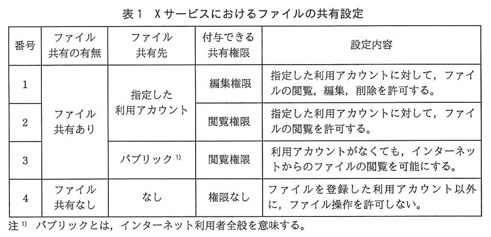

〔Xサービス利用規則〕
　2年前，Xサービスの利用開始に当たって，製造部ではXサービス利用規則を作成し，部内に通知した．現在のXサービス利用規則を図1に示す．  
　なお，J社の社内規程では，スマートフォンやタブレットの業務利用は認めていない．かつ，PCを社外に持ち出して使用することも禁止している．

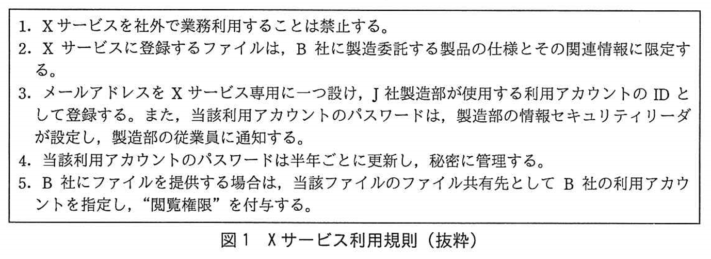

〔事故発生〕  
　1か月前，Q社からJ社に連絡が入った．Q社はJ社と取引関係はないが，Q社従業員がインターネット検索を行っていたところ，J社の社名が記載され，秘密情報と記されたファイルがXサービスで公開されているのを発見したので連絡したということであった．製造部の情報セキュリティリーダであるS主任が調査したところ，J社がB社に提供するためにXサービスに登録している顧客企業の製品製造に関係するファイルの一つが公開されてしまっていることが判明した．問題のファイルは，ファイル共有先に ~~a1~~ が指定され，かつ，共有権限に ~~a2~~ が付与されていた．  
　S主任から報告を受けた製造部の情報セキュリティ責任者であるT部長は，CISOに一報を入れるとともに，<u>①直ちにXサービスに登録している全てのファイルを削除し，Xサービスの利用を中止するように指示した</u>．  
　今回の事故を重く見たCISOは，情報セキュリティ委員会を招集し，T部長に事故原因の調査と対策の検討を指示した．また，情報システム課のU課長には，製造部への支援を指示した．

〔原因調査〕  
　S主任は，T部長から指示を受けて事故原因の調査を開始し，Xサービスの情報セキュリティに影響する問題，つまり外部からの攻撃やシステム障害などが発生しなかったか，対象ファイルの共有設定を変更した者は誰かなどをX社に問い合わせた．X社からは，Xサービスの情報セキュリティに影響する問題は発生しておらず，また，操作の履歴情報を開示できるのは法令に基づいた開示請求があった場合に限ると回答があった．  
　X社から調査協力を得ることができず，また，この時点で事件として警察に捜査を依頼することも難しいと思われたので，S主任はU課長と相談し，J社内の調査を進めることにした．U課長は<u>②プロキシサーバを調査した</u>が，不審な点は確認されず，また，製造部の全PCも調査したが問題点は見つけられなかったので，S主任は製造部の従業員全員に個別にヒアリングを行うことにした．

〔個別ヒアリング〕  
　S主任は，自分とT部長を除く製造部の従業員48名一人一人に対して，Xサービスの利用状況を確認した．ヒアリング結果を図2に示す．

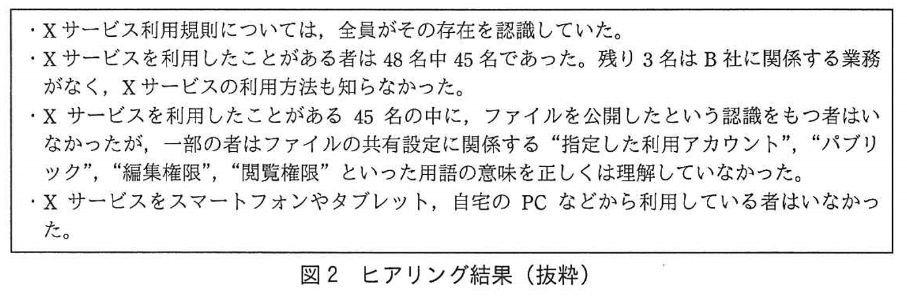

　Xサービスでは，ファイル登録時点の共有設定は，ファイル共有先"なし"，共有権限"権限なし"が初期値である．B社にファイルを提供するには，ファイル登録時，又は登録後に共有設定を変更する必要がある．S主任は，ヒアリング結果のうち ~~b~~ という製造部の状況では，"B社にファイルを提供する際に，Xサービスのファイル共有設定を間違える"という事故が起きやすいと考えた．そこで，従業員がXサービスの利用を開始する時点でXサービス利用規則と利用方法についての十分な教育を行うとともに，<u>③万一間違った共有設定がなされても第三者にファイルを読まれる可能性を下げる対策</u>をXサービス利用規則の中に定めておくべきであったと反省した．

〔問題点の整理，対策の検討〕  
　S主任は，一連の調査結果をT部長に報告した．T部長は，Xサービスの利用中止によってB社への製造委託に支障を来していることから，Xサービスの利用を早期に再開できるようにS主任に検討を指示した．S主任は，製造部の従業員による共有設定の誤り防止を含めた対策をU課長と相談した．U課長は，XサービスをB社へのファイル提供に利用したこと自体が誤りであったとして，表2のように，Xサービスを業務で利用することの問題点とその理由を三つ指摘した．

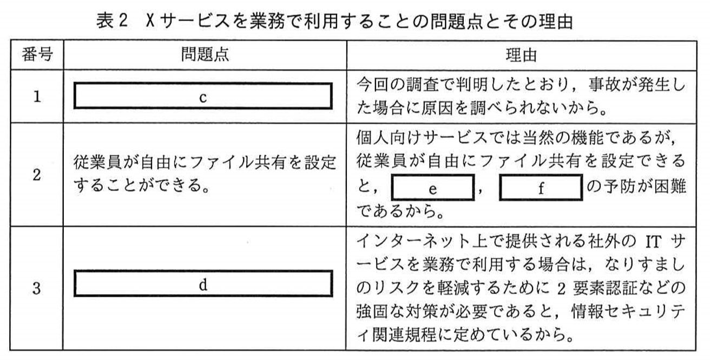

　次は，U課長とS主任の会話である．

| | |
|:---|:---|
| U課長： | 製造部の業務を考慮すると，USBメモリを使ったファイル提供に戻すことは難しいのではないかと思いますが，何か代替案を考えていますか．|
| S主任： | 同じオンラインストレージサービスでも，法人向けに有償で提供されているサービスには管理機能を強化しているものが多いので，そうしたサービスを使うことを考えたいと思います．|
| U課長： | 利用するサービス自体を切り替えることによって，問題点1～3の解決を図るということですね．|
| S主任： | はい．ただし，現在のXサービス利用規則の内容では，<u>④事故発生時の原因特定は困難<です</u>．適切な法人向けサービスに切り替えるとともに，利用規則も作り直すつもりです．|
| U課長： | 今回の事故によって，全社の情報セキュリティ対策がまだ十分でないことに気付きました．情報セキュリティ委員会の事務局として，情報セキュリティ委員会に対して追加の<u>⑤組織的対策</u>を行うように働きかけた上で，情報システム課としても<u>⑥技術的対策</u>を進め，情報セキュリティの改善に努めます．|

　S主任は，新しい利用規則をどのように作成すべきか，U課長とともに検討した．また，法人向けサービスの選定方法についてU課長から技術的なアドバイスを受けた．  
　その後，S任は問題点1～3に対応したオンラインストレージサービスとして，W社の法人向けオンラインストレージサービス(以下，Wサービスという)を選定し，Xサービスからの切替えについて，T部長の承認を得た．T部長は，情報セキュリティ委員会の承認と顧客企業各社の了解を得た上でWサービスの利用規則を新たに定め，製造部従業員への周知など十分な準備を行い，Wサービスを使ってB社へのファイル提供を再開した．

**解説**

　インターネット上で提供されるサービスの業務利用に関する問題であり，**オンラインストレージサービス**（5.5.3参照）がテーマになっています．**プロキシサーバ**（5.2.2参照）についての知識も必要であり，テーマはセキュリティですが，ネットワーク寄りの出題です．

**設問1**〔事故発生〕について，(1)，(2)に答えよ．

**(1)** 本文中の ~~a1~~，~~a2~~ に入れる字句の組合せはどれか．aに関する解答群のうち，適切なものを選べ．

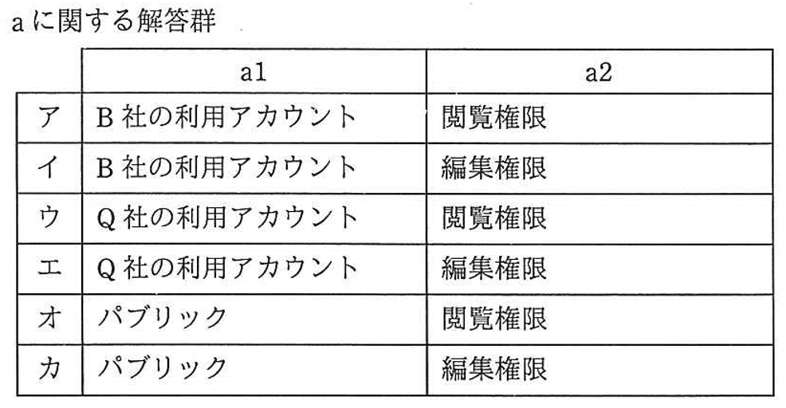

**正解：ａ－オ**

事故内容は「顧客企業の製品製造に関係するファイルの一つが公開されてしまっていること」ですから，表１の４種類の共有設定の中から，「ファイルが公開されてしまう」ことに当てはまるものを探すと，３番のみだとわかります．
よってファイル共有先は「パブリック」，付与できる共有権限は「閲覧制限」が正解です．

**(2)** 本文中の下線①のように指示した理由はどれか．解答群のうち，最も適切なものを選べ．

解答群  

| | |
|:--|:--|
| ア | J社が使用しているXサービスの利用アカウントのIDとパスワードが漏えいしたことが明らかであり，J社がXサービスに登録している全てのファイルに被害が及ぶおそれがあったから |
| イ | Xサービスがサイバー攻撃を受けたことが明らかであり，公開されたファイルの他にも，流出したファイルやマルウェア感染などの被害を受けたファイルが存在する可能性があったから |
| ウ | Xサービスよりも機能が豊富であり，かつ，不正アクセスやマルウェアへの対策も十分な信頼できるサービスに早急に移行することを決定したから |
| エ | 原因は不明だが，Xサービスに登録されている全てのファイルが公開されたことが明らかであり，]社としても早急に被害の拡大を防止する必要があったから |
| オ | ファイルが公開された原因が不明であり，J社がXサービスに登録している他のファイルや，今後登録するファイルにも被害が及ぶおそれがあったから |
| カ | ファイルがマルウェアに感染したことが明らかであり，J社がXサービスに登録している他のファイルや，今後登録するファイルにも被害が及ぶおそれがあったから |

**正解：オ**

事故発生の時点では原因が明らかになっていませんので「ファイルが公開された原因が不明であり」が適切です．被害の拡大を防ぐ措置を最優先すべきですので「今後登録するファイルにも被害が及ぶおそれがある」ことが理由だと判断できます．

アは「J社が使用しているXサービスの利用アカウントのIDとパスワードが漏えいしたことが明らか」ではありませんので不適切です．  
イは「Xサービスがサイバー攻撃を受けたことが明らか」ではありませんので不適切です．  
ウは「Xサービスよりも機能が豊富であり，かつ，不正アクセスやマルウェアへの対策も十分な信頼できるサービス」に該当する記述がありません．  
エは「Xサービスに登録されている全てのファイルが公開されたことが明らか」ではありませんので不適切です．  
カは「ファイルがマルウェアに感染したことが明らか」ではありませんので不適切です．

**設問2** 本文中の下線②について，次の(ⅰ)～(ⅲ)のうち，調査を行う目的として適切なものだけを全て挙げた組合せを，解答群の中から選べ．

| | |
|:--|:--|
| (i) | Xサービス以外のオンラインストレージサービスが利用されていなかったかを確認するため |
| (ii) | 情報システム課が一時的に制限を解除したWebサイトへの接続状況を確認するため |
| (iii) | 製造部のPC以外のJ社PCの中に，Xサービスに接続したものがあるかを確認するため |

解答群

| | | | | | |
|:----|:----|:----|:----|:----|:----|
| ア | (i)  | イ | (i)，(ii) | ウ | (i)，(ii)，(iii) |
| エ | (i)，(iii)  | オ | (ii) | カ | (ii)，(iii) |
| キ | (iii)  |

**正解：キ**

問題文の２つめの段落に「社外のWebサーバの閲覧は，すべてプロキシサーバ経由」という記述がありますので，プロキシサーバを調査すれば「製造部のPC以外からのXサービスへの接続の有無」がわかります．よって，(iii)が目的です．  
〔事故発生〕にあるとおり「秘密情報と記されたファイルがXサービスで公開されている」ことが問題であり，「Xサービス以外のオンラインストレージサービスが利用されていたかどうか」は無関係です．よって(i)は不適切で，同様に(ii)の「情報システム課が一時的に制限を解除したWebサイトへの接続状況」も無関係です．  
以上から(iii)のみが該当します．

**設問3**〔個別ヒアリング〕について，(1)，(2)に答えよ．

**(1)** 本文中の ~~b~~ に入れる字句はどれか．解答群のうち，最も適切なものを選べ．

b に関する解答群

| | |
|:---|:---|
| ア | Xサービスの利用方法を知らない従業員が3名いた |
| イ | Xサービス利用規則の存在を従業員全員が認識していた |
| ウ | Xサービスをスマートフォンやタブレット，自宅のPCなどから利用している従業員がいなかった |
| エ | ファイルの共有設定に関係する用語の意味を正しくは理解していない従業員がいた |

**正解：ｂ－エ**

「~~ｂ~~ という製造部の状況では"ファイル共有設定を間違える"という事故が起きやすい」とありますので，ファイル共有設定に関する選択肢がもっとも適切であると判断できます．  
アの「利用方法を知らない」ことも，事故の原因にはなりますが，エに比べると焦点がボケており，最も適切なものではありません．  
イの「利用規約の存在の認識」，ウの「利用場所の限定」は事故の原因にはなりません．

**(2)** 本文中の下線③について，次の(i)～(iv)のうち，該当する対策だけを全て挙げた組合せを，解答群の中から選べ．   

| | |
|:---|:---|
|(i)| 登録するファイルに電子署名を付与する．|
|(ii)| 登録するファイルを暗号化する．|  
|(iii)| ファイル登録後，B社だけに，登録したファイルのハッシュ値を連絡する．|  
|(iv)| ファイル登録後，B社だけに連絡し，B社のダウンロードが完了次第直ちに削除する．|

解答群

| | | | | | |
|:----|:----|:----|:----|:----|:----|
| ア |(i)，(ii)| イ |(i)，(ii)，(iii)| ウ |(i)，(ii)，(iv)|
| エ |(i)，(iii)| オ |(i)，(iii)，(iv)| カ |(i)，(iv)|
| キ |(ii)，(iii)| ク |(ii)，(iii)，(iv)| ケ |(ii)，(iv)|
| コ |(iii)，(iv)|

**正解：ケ**

「万が一，間違った共有設定がなされても第三者にファイルを読まれる可能性を下げる対策」ですので，まず(ii)の暗号化が当てはまります．  
また，(iv)のファイルの存在する時間を短縮する対策も「読まれる可能性を下げる」ことができますので当てはまります．  
よって，(ii)と(iv)が該当します．
(i)の **電子署名**（**ディジタル署名**（1.1.11参照））と，(iii)のハッシュ値は改ざん防止策であり，この対策にはなりません．

**設問4**〔問題点の整理，対策の検討〕について，(1)～(4)に答えよ．  

**(1)** 表2中の ~~c~~，~~d~~ に入れる字句はどれか．解答群のうち，最も適切なものを選べ．  

c，d に関する解答群

|    |    |
|:---|:---|
| ア | スマートフォンやタブレットから利用できる．|
| イ | 操作の履歴情報が提供されない．|
| ウ | 通信中の情報が暗号化されない．|
| エ | 登録したファイルに対するウイルスチェック機能をもたない．|
| オ | メールアドレスとパスワードだけで利用できる．|

**正解：ｃ－イ**

番号１の理由に「事故が発生した場合に原因を調べられない」とありますので，これに対応する問題点は「操作の履歴情報が提供されない」ことです．

**正解：ｄ－オ**

番号１の理由に「**２要素認証**（1.1.12参照）などの強固な対策が必要」とありますので，これに対応する問題点は「１要素認証になっていること」だとわかります．よって「メールアドレスとパスワードだけ」という記憶による１要素認証のみが当てはまります．

**(2)** 表2中の ~~e~~，  ~~f~~ に入れる字句はどれか．解答群のうち，最も適切なものを選べ．

e，f に関する解答群

| | | | | | |
|:----|:----|:----|:----|:----|:----|
| ア | DDoS攻撃 | イ | 意図的な公開 | ウ | クラッキング |
| エ | 誤操作 | オ | スパムメール | カ | 中間者攻撃 |
| キ | なりすまし | ク | フィッシング | ケ | 紛失 |

**正解：ｅ,ｆ－イ,エ**

「従業員が自由にファイル共有を設定できる」という問題点の理由ですので，予防が困難なのはイの「わざと公開してしまうこと」とエの「誤って公開してしまうこと」だと分かります．  
この問題点には，外部からの攻撃は該当しません，DDoS攻撃，クラッキング，スパムメール，中間者攻撃，なりすまし，フィッシングは当てはまりません．また，紛失は無関係です．

**(3)** 本文中の下線④について，図1のどの項番が事故発生時の原因特定を困難にしているか．解答群のうち，最も適切なものを選べ．

解答群

|     |     |     |     |     |     |     |     |     |     |
|:----|:----|:----|:----|:----|:----|:----|:----|:----|:----|
| ア  |  1  | イ  |  2  | ウ  |  3  | エ  |  4  | オ  |  5  |

**正解：ウ**

図１の中で「事故発生時の原因特定は困難」としている主な原因を検討すると，項番３「製造部が利用するアカウント」と項番５の「B社が利用するアカウント」の２項目において，アカウントが個人ではなく，グループに与えられていることが該当します．  
しかし，今回は「B社にファイルを提供する場合」ではありませんので項番５は無関係であり，項番３が該当します．

**(4)** 本文中の下線⑤及び⑥について，次の(i)～(viii)のうち，今回の事故を受けて情報セキュリティ委員会と情報システム課が行うべき対策を三つ挙げた組合せはどれか．解答群のうち，最も適切なものを選べ．  

[情報セキュリティ委員会が行うべき組織的対策]  

|   |   |
|:--|:--|
|(i)| オンラインストレージサービス業者との秘密保持契約を見直し，情報流出の予防に関する条項を強化する．|
|(ii)| 業務に関係がないインターネット利用を禁止する旨を情報セキュリティ関連規程に定める．|
|(iii)| 社外のITサービスの導入について，全て情報セキュリティ委員会の承認を必要とすることを情報セキュリティ関連規程に定める．|
|(iv)| 情報システムの利用アカウントの共有を禁止する旨を情報セキュリティ関連規程に定める．|

[情報システム課が行うべき技術的対策]

|   |   |
|:--|:--|
|(v)| Xサービスの利用アカウントのIDに登録していたメールアドレスを廃止し，新たに選定する法人向けのオンラインストレージサービスの利用アカウントのIDとして登録する専用のメールアドレスを新たに用意する．|
|(vi)| 新たに選定する法人向けのオンラインストレージサービスに登録する全てのファイルを，定期的にバックアップする．|
|(vii)| 新たに選定する法人向けのオンラインストレージサービスに登録するファイルに電子署名を付与するために，電子証明書を準備する．|
|(viii)| オンラインストレージサービスは，情報セキュリティ委員会の承認を得たものだけ接続を許可するようにコンテンツフィルタを設定する．|

解答群

| | | | | | |
|:----|:----|:----|:----|:----|:----|
| ア |(i)，(ii)，(vi)| イ |(i)，(iv)，(viii)| ウ |(i)，(v)，(viii)|
| エ |(ii)，(iii)，(vii)| オ |(ii)，(iv)，(vi)| カ |(ii)，(vi)，(vii)|
| キ |(iii)，(iv)，(viii)| ク |(iii)，(v)，(vii)| ケ |(iii)，(vi)，(viii)|
| コ |(iv)，(v)，(vi)|

**正解：キ**

まず，[情報セキュリティ委員会が行うべき組織的対策] から検討します．選択肢の中で，すぐに対策を行うべきと判断できるのは(iv)のアカウント共有の禁止です．IDの共有が「事故発生時の原因特定を困難」にしていますので，まず，これが該当します．  
次に，残り３つを本文の説明と比較します．すると，製造部がＸサービスの利用にあたって「情報セキュリティ委員会の承認を得た」という記述がないことがわかります．よって，情報セキュリティ委員会の承認を必要とする(iii)も該当すると判断できます．  
(i)の「業者との秘密保持契約の見直し」や，(ii)の「業務に関係がないインターネット利用の禁止」は「今回の事故を受けて」の対策ではありません．  
残り一つは[情報システム課が行うべき技術的対策]の中にあるとわかります．そこで，この中に，すでに選んだ(iv)と(iii)に関連するものがないかを検討すると，(iii)の「情報セキュリティ委員会の承認」を必須にしたら，(viii)の「情報セキュリティ委員会の承認を得たものだけ接続を許可するように」する対策が一致します．  
(vi)の「バックアップ」と(vii)の「電子証明書」は「今回の事故を受けて」の対策ではありません．  
また，(v)の「メールアドレスの変更」は(iv)のアカウント共有が解決しませんので不適切です．  
以上から，(iii)，(iv)，(viii)が行うべき対策です．

## 17.2　問２　情報機器の紛失

**問２**　情報機器の紛失に関する次の記述を読んで，設問1，2に答えよ．

　Z社は，従業員数2,000名の生命保険会社であり，東京に本社をもち，全国に支社が点在している．以下，本社及び各支社を拠点という．  
　Z社では，拠点の営業員が，会社貸与の持出し用ノートPC(以下，NPCという)を携帯して顧客を訪問し，商品説明資料，見積書，契約書の作成などを行っている．Z社の本社情報システム部は，NPCの情報セキュリティ対策とその持出し管理のために，表1に示すルールを定めている．  

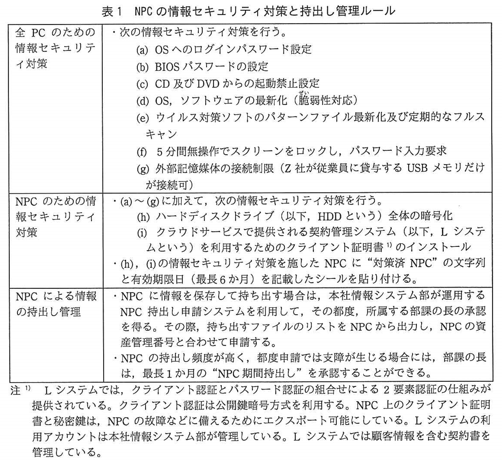

　Z社は，各拠点に情報セキュリティ管理責任者とその配下の情報セキュリティリーダを置いている．また，各拠点に配置された情報システム担当は，各拠点で利用するPCなどの情報機器の貸出し，表1に示した情報セキュリティ対策の設定と維持，持出し管理の実施指導，本社情報システム部と連携した情報システムの運用管理，利用支援などを行っている．  
　Z社の情報セキュリティ管理規程では，顧客情報を含めZ社が秘密として管理している情報(以下，秘密情報という)の漏えい及びその可能性がある情報セキュリティインシデント(以下，情報セキュリティインシデントをインシデントという)が発生した場合の対応手順を定めている．そのうち，従業員に貸与している情報機器の紛失・盗難が発生した場合の対応手順は図1のとおりである．  

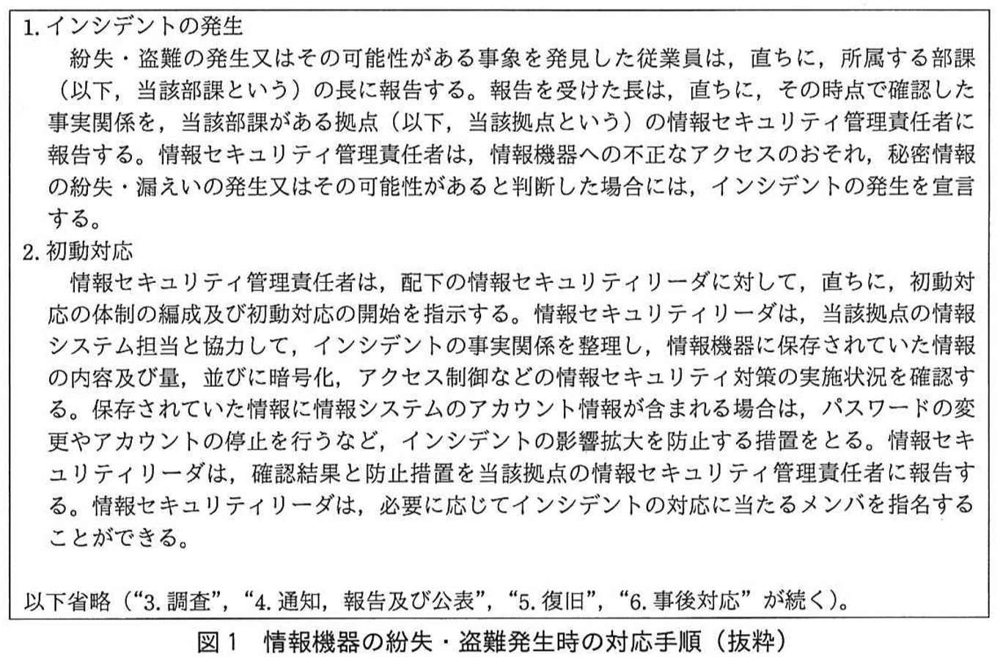

〔情報機器の紛失〕  
　R支社は，従業員数100名の支社であり，営業員が60名いる．R支社では，支社長が情報セキュリティ管理責任者を務め，各部課の長が情報セキュリティリーダを務めている．  
　10月12日(水)10時30分頃，R支社の営業部1課のFさんが，客先からR支社に戻る途中，電車の網棚にかばんを置き忘れるという事象が発生した．かばんの中には，NPCが入っていた．  
　報告を受けたR支社長は，インシデントの発生を宣言し，営業部1課の情報セキュリティリーダであるK課長に対して，直ちに初動対応を開始するよう指示した．また，R支社長の指示によって，K課長，各部の部長，及びR支社の情報システム担当として初動対応に当たるW主任が出席して，インシデント対策会議が開催されることとなった．  
　幸い，当日の15時頃にかばんとその中のNPCを回収することができた．しかし，紛失している間に，外部の者によってNPCを操作されたり，NPCから情報を窃取されたりした可能性は否定できない．K課長は，調査を継続しつつ，16時30分に開催予定のインシデント対策会議に向けてインシデント報告書案を作成することにした．

〔インシデント報告書案の作成〕  
　K課長は，まず，Fさんが置き忘れた情報機器(以下，紛失機器という)，紛失機器に保存されていた情報，及び紛失機器における情報セキュリティ対策の実施状況を表2のとおり整理した．

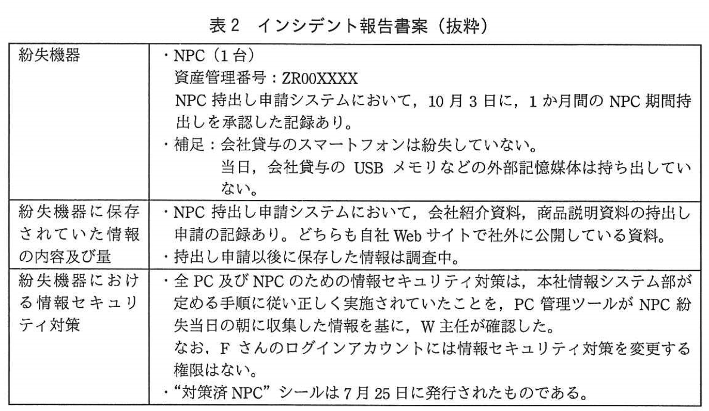

　続いて，K課長は，インシデント報告書案の一部として，インシデント発生とその初動対応の経緯を図2のとおり整理した．

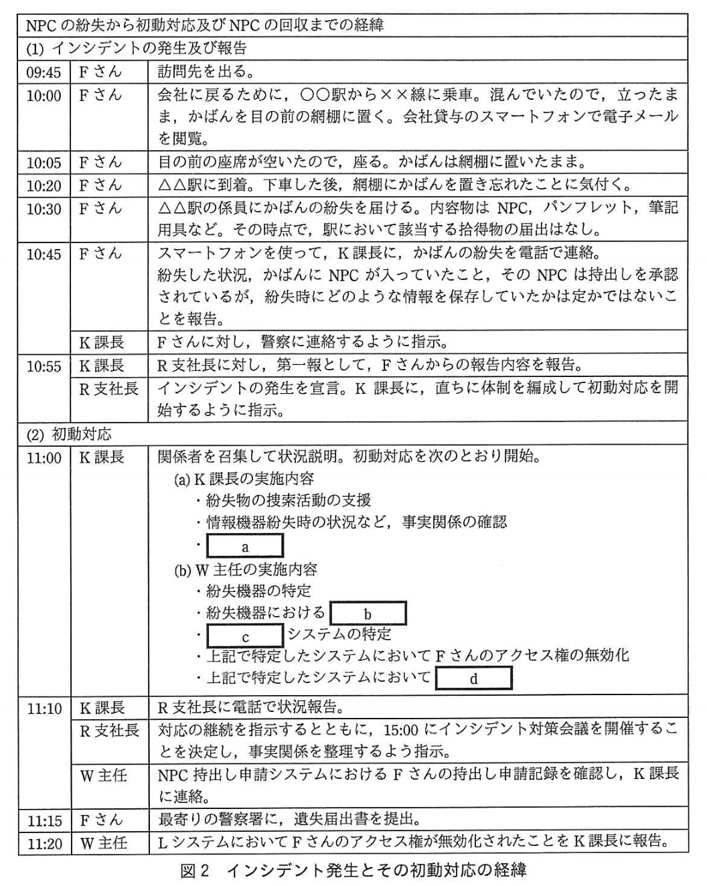

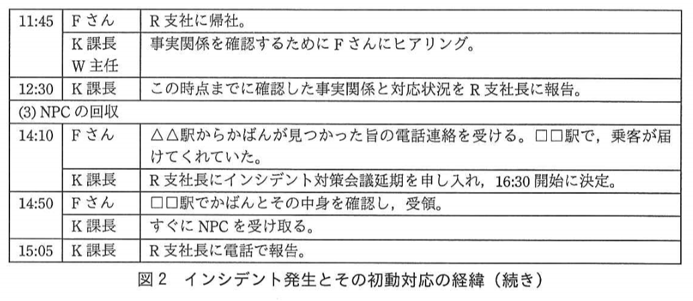

〔インシデントの影響及び対応〕
　16時に，K課長はW主任に声を掛け，インシデント対策会議の事前確認のための打合せを行った．次はその時の会話である．

|    |    |
|:---|:---|
| K課長：| Fさんは，NPCにはどのような情報が入っていたか定かではないと言っていました．契約書などの顧客情報は入っていたのでしょうか．|
| W主任：| NPCの持出し申請の時点では，顧客情報は含まれていませんでした．ただし，<u>①持出しの承認の後でも，NPCに顧客情報を追加で保存できてしまいます</u>． |
| K課長：| 分かりました．<u>②当社で定めた手順のうち，NPC紛失時にNPCの中の情報を盗まれるリスクを低減する手順</u>は，施されていたでしょうか．
| W主任：| はい．もちろんです．|
| K課長：| 紛失時点で顧客情報がNPCに保存されていたかどうか，紛失後にNPCに誰かがアクセスしていたか，確認をお願いします．ところで，今，FさんはLシステムにアクセスができない状態ですね．|
| W主任：| はい．FさんのNPC内にあるクライアント証明書と秘密健が盗用される可能性を考慮した措置です．もし，Fさんの利用アカウントで認証に成功したとしたら，Fさんが担当する全ての顧客の情報にアクセスできてしまいます．|
| K課長： | すばやく対応してくれましたね．|
| W主任： | 秘密鍵の漏えいの有無を調査するために，何者かがFさんの秘密鍵を使い，クライアント認証して ~~e1~~ がLシステムの ~~e2~~ のログ中にないか確認しました．確認したログの範囲では，不審な点はありませんでした．FさんがまたLシステムにアクセスできる状態にするために，~~f~~，アクセス権を有効にする予定です．|
| K課長：| FさんのNPCは，今後どのようになるのでしょうか．|
| W主任：| 一時的にでも自社の管理を離れたことによって情報が盗まれたり，マルウエアが入れられたりした可能性があるので，~~g1~~．|
| K課長：| ~~g2~~．|

　こうしてK課長はインシデント対策会議に臨み，インシデント報告書案に沿って事実関係，対応状況及び今後の調査予定を報告し，R支社長の了解を得た．  
　2日後，W主任から，NPC内に顧客情報は追加保存されていなかったこと，及びFさんがNPCを紛失していた間にNPCがアクセスされた痕跡はなかったことの報告があり，このインシデントは収束が宣言された．

**解説**

　従業員の外出先でのノートPC紛失という情報セキュリティ・インシデントへの正しい対応を問う問題です．初動対応の具体的な手順，リスク低減策，証拠の保全などに関する知識や状況を想定する能力が求められています．

**設問1**〔インシデント報告書案の作成〕について，図2中の ~~a~~ ～ ~~d~~ に入れる字句はどれか．解答群のうち，最も適切なものを選べ．

a に関する解答群

|    |    |
|:---|:---|
| ア | Fさんが紛失した情報の内容及び量の特定 |
| イ | Fさんが持ち出した情報の持出し方法の特定 |
| ウ | インシデントによる損害額の検討 |
| エ | インシデントの再発防止策の策定 |

**正解：ア**

インシデントが発生した部署のセキュリティリーダであるK課長の初動対応ですので，図１のとおり「情報機器に保存されていた情報の内容及び量」を把握することが最優先となります．よって「紛失した情報の内容及び量の特定」が該当します．  
ウの「損害額の検討」は上記が把握できないと行えません．  
イの「持出し方法の特定」はエの「再発防止策の策定」に含めて後日行うべきです．  

b に関する解答群

|    |    |
|:---|:---|
| ア | "対策済NPC"シール発行記録の確認 |
| イ | Fさんの利用記録の確認 |
| ウ | 資産管理番号とFさんへの貸与記録の確認 |
| エ | 情報セキュリティ対策の実施状況の確認 |

**正解：エ**

支社の情報システム担当であるW主任の「紛失機器における」初動対応ですので，図１のとおり「情報セキュリティ対策の実施状況の確認」を行う必要がありますので，エが該当します．  
アの「対策済NPCシールの確認」，イの「利用記録の確認」，ウの「資産管理番号などの確認」に関する記述は図１中にありませんので「紛失機器における」初動対応としては該当しません．

c に関する解答群

|    |    |
|:---|:---|
| ア | Fさんがオフィスで，使っている |
| イ | Fさんが外出先からアクセスできる |
| ウ | Fさんが顧客情報を保管している |
| エ | Fさんが顧客訪問の際に画面を見せてもらったことがある |

**正解：イ**

同じくW主任の「システムの特定」に関する初動対応で，図１の「インシデントの事実関係の整理」にあたります．今回はNPCの紛失ですので，「紛失している間に，外部の者によってNPCを操作された」ことを前提として「Fさんが外出先からアクセスできるシステムの特定」することが適切であり，アの「Fさんがオフィスで，使っているシステム」は無関係です．  
また，ウの「顧客情報を保管しているシステム」やエの「画面を見せてもらったことがあるシステム」は，該当しません．  

d に関する解答群

|    |    |
|:---|:---|
| ア | Fさんが当日訪問した顧客に関する顧客情報がダウンロードされていないかどうかに絞った確認 |
| イ | 社外から操作ログが改ざんされていないかどうかの確認 |
| ウ | 社外からパスワードリスト攻撃が行われていないかどうかの重点的な確認 |
| エ | 社外から不審なアクセスがないかどうかの幅広い確認 |

**正解：エ**

同じくW主任の「Fさんが外出先からアクセスできるシステムにおける」初動対応で，「Fさんのアクセス権の無効化」と共に行うべきことを選びます．この時点で確認対象を絞り込むことは，図１の「インシデントの事実関係」の見落としにつながりますので「社外から不審なアクセスがないかどうかの幅広い確認」が該当します．  
エ以外は絞り込みを伴う確認ですので，不適切です．

**設問2**〔インシデントの影響及び対応〕について，(1)～(5)に答えよ．  

**(1)** 本文中の下線①について，どのような方法が考えられるか．次の(i)～(v)のうち，該当するものだけを全て挙げた組合せを，解答群の中から選べ．  

|    |    |
|:---|:---|
|（i）| 1か月間のNPC期間持出しの承認を得るとその期間中に，NPCを会社に持ち帰り，追加で保存できる．|
|（ii）| NPCの持出しとは別に，会社貸与のUSBメモリに保存して持ち出すことによって，NPCに保存できる．|
|（iii）| 外出先からLシステムにアクセスして，NPCにダウンロードして保存できる．|
|（iv）| 外出先で，公衆無線LANに接続して，インターネット上で他社の公開Webサイトを閲覧し，NPCにダウンロードして保存できる．|
|（v）| 顧客訪問先で，顧客から借りたUSBメモリからコピーして保存できる．

解答群

|    |    |    |    |
|:---|:---|:---|:---|
| ア |(i)，(ii)，(iii)| イ |(i)，(ii)，(iii)，(iv)，(v)|
| ウ |(i)，(ii)，(iii)，(v)| エ |(i)，(iii)|
| オ |(i)，(iii)，(v)| カ |(i)，(v)|
| キ |(ii)，(iii)，(v)| ク |(ii)，(v)|
| ケ |(iii)，(iv)，(v)| コ |(iii)，(v)|

**正解：ア**

持出しの承認の後で，NPCに契約書などの顧客情報を追加で保存できる方法としては，まず(i)の「会社内での追加」に加えて，(ii)の「会社貸与のUSBメモリ経由での追加」が考えられます．表１(g)にあるとおり，Z社が従業員に貸与するUSBメモリは接続可能だからです．  
そして，表１(i)と「注」にある通り，クラウドサービスで提供されるLシステムでは，顧客情報を含む契約書を管理していますので，(iii)の「外出先からLシステムにアクセスして顧客情報をNPCにダウンロード」することも可能です．  
これに対して，契約書などの顧客情報は他社の公開Webサイトにはありませんので，(iv)は該当しません．  
また，表１(g)にあるとおり，顧客から借りたUSBメモリは接続できませんので，(v)は不適切です．  
以上から該当するのは(i)(ii)(iii)だとわかります．

**(2)** 本文中の下線②について，表1に記載されている対策のうち，NPC紛失時に，NPC内のデータが読み取られるリスクを低減するための対策として最も効果的なものを，解答群の中から選べ．

解答群

| | | | | | |
|:---|:---|:---|:---|:---|:---|
| ア |(a)| イ |(b)| ウ |(c)|
| エ |(d)| オ |(e)| カ |(f)|
| キ |(g)| ク |(h)| ケ |(i)|

**正解：ク**

「NPC紛失時に，NPC内のデータが読み取られるリスクを低減するための対策」としては，NPCが分解されてHDDが取り出され，他のPCなどによって読みだされる可能性を考慮する必要があります．  
よって，NPC本体に対する対策である(a)，(b)，(c)，(d)，(e)，(f)，(g)では不適切で，HDD自体を保護できる(h)の「HDD全体の暗号化」が最適です．
なお，(i)のクライアント証明書はNPC内のデータに関するものではありませんので無関係です．

**(3)** 本文中の  ~~e1~~，~~e2~~ に入れる字句の組合せはどれか．eに関する解答群のうち，最も適切なものを選べ．

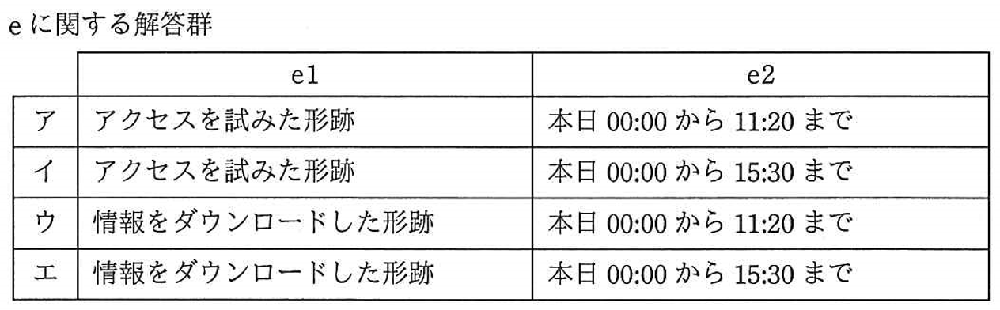

**正解：ｅーイ**

~~e1~~ の選択肢は「アクセスを試みた形跡」と「情報をダウンロードした形跡」であり，前者が後者の前に記録されますし，情報をダウンロードしたかどうかに関わらず，前者が残されていれば対処が必要です．よって，~~e1~~ は前者の「アクセスを試みた形跡」です．  
~~e2~~ の選択肢はログの時間帯についてであり，図２の「LシステムにおいてFさんのアクセス権が無効化された」11:20までのログでは，それ以降に何者かがアクセスを試みた形跡を得ることができません．よって，より広い「本日00:00から15:30まで」が適切です．

**(4)** 本文中の ~~f~~ に入れる適切な字句を，解答群の中から選べ．

f に関する解答群

|    |    |
|:---|:---|
| ア | FさんのLシステムの利用アカウントのパスワードを変更した後 |
| イ | Fさんの従来のクライアント証明書を失効させてから，新しい鍵ペアを生成しクライアント証明書を発行し直した後 |
| ウ | Fさんの秘密鍵のバックアップを取り寄せた後 |
| エ | 本社情報システム部でLシステムのログを保全した後 |

**正解：ｆ－イ**

「FさんがまたLシステムにアクセスできる状態にするために」行うことを問う問題であり，表１の（i）と注に「Lシステムを利用するためのクライアント証明書はエクスポート可能」とあることから，まず，これを失効させることが必要です．その上で，新しい鍵ペアを生成しクライアント証明書を発行し直せば，アクセスを許可できます．  
アの「パスワード再発行」は不適切ではありませんが，まず，何者かにエクスポートされた可能性があるクライアント証明書を使い続ける危険性に対処すべきです．  
ウの「秘密鍵のバックアップ」は用いずに秘密鍵を再生成すべきですので誤りです．  
エの「ログの保全」はFさんの件とは無関係に日常で行われるべき作業ですので不適切です．

**(5)** 本文中の ~~g1~~，~~g2~~ に入れる字句の組合せはどれか．gに関する解答群のうち，最も適切なものを選べ．

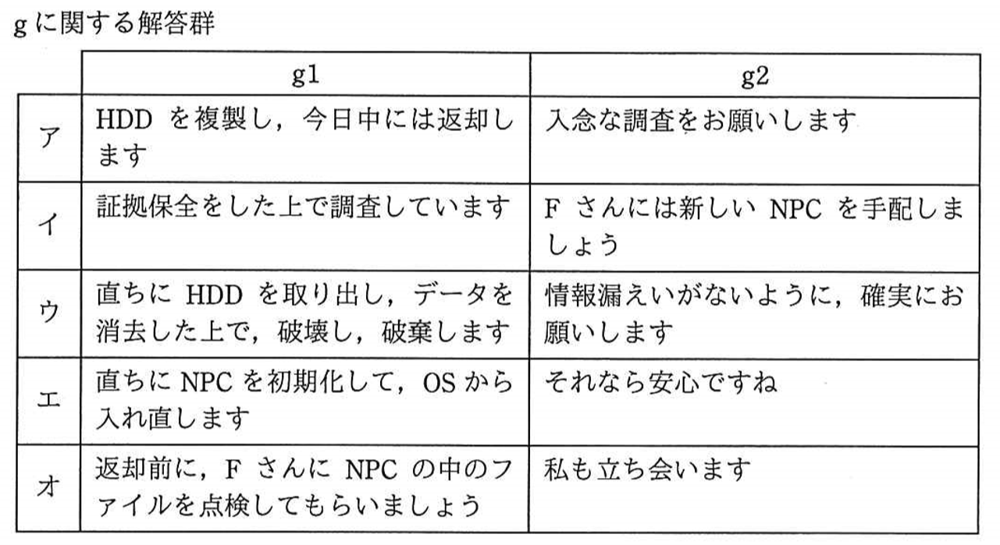

**正解：ｇ－イ**

~~g1~~ には「一時的にでも自社の管理を離れたことによって情報が盗まれたり，マルウエアが入れられたりした可能性がある」ことへの情報システムの対策が入ります．よって，ここまでに得られた証拠を保全するとともに，調査の継続が必要ですから「証拠保全をした上で調査」が適切です．  
~~g2~~ には上記を受けて現場で行うべきことが入ります．現在のNPCはそのまま調査対象になりますので業務再開のための「新しいNPCの手配」が適切です．  
「一時的にでも自社の管理を離れたことによって情報が盗まれたり，マルウエアが入れられたりした可能性がある」のですから，アの「HDDの複製」やオの「ファイルの点検」は不適切です．  
また，調査を継続しますので，ウの「破壊」やエの「初期化」も行うべきではありません．

## 17.3　問３　業務用PCでのWebサイト閲覧

**問3** 業務用PCでのWebサイト閲覧に関する次の記述を読んで，設問1～3に答えよ．

　P社は，従業員数1,000名の消費者向け健康食品製造会社であり，経営方針として自社のブランドイメージを重視している．P社のマーケティング部では，社外向けWebサイトのコンテンツのうち，製品紹介情報，IR情報，CSR情報などの管理を行っている．マーケティング部には20名が在籍し，二つの課がある．マーケティング1課は，ブランドマーケテイング戦略を担当している．マーケテイング部では，情報セキュリティ責任者をA部長が，情報セキュリティリーダをマーケティング1課のB課長が務めている．  
　P社では全従業員が基盤情報システムを利用して日々の業務を行っている．基盤情報システムは，会社貸与の業務用PC(以下，PCという)，LAN及びインターネット接続から成るネットワークサービス，ディレクトリサービス，社内ファイル共有サービス，電子メールサービスなどから構成されている．P社従業員は，LANに接続された各自のPCから各サービスを利用している．また，LANからのプロキシサーバを経由しないインターネット接続はファイアウォールによって遮断されている．  
　P社には，基盤情報システム以外にも勤怠管理システム，交通費精算管理システム及び人事管理システムがある．P社従業員は，出勤時と退勤時に各自の磁気ストライプカード型の従業員証をタイムレコーダに通すことになっており，出退勤時刻が勤怠管理システムに記録される．P社の課長以上の職位の者は，直属の部下について，勤怠管理システムを用いて出退勤時刻などの勤怠管理情報を，交通費精算管理システムを用いて交通費精算情報を，人事管理システムを用いて人事評価情報を確認できる．  
　基盤情報システム，勤怠管理システム，交通費精算管理システム及び人事管理システムは同じタイムサーバに基づいて時刻同期がなされている．それらの情報システム及び自社Webサイトの構築と運用管理は，情報システム部が行っている．  
　情報システム部のC部長が，P社の最高情報セキュリティ責任者(CISO)を務めている．情報システム部には運用管理課があり，基盤情報システムに対して図1に示す設定と運用管理を行っている．また，利用については図2に示すP社基盤情報システム利用規程(以下，利用規程という)を整備している．

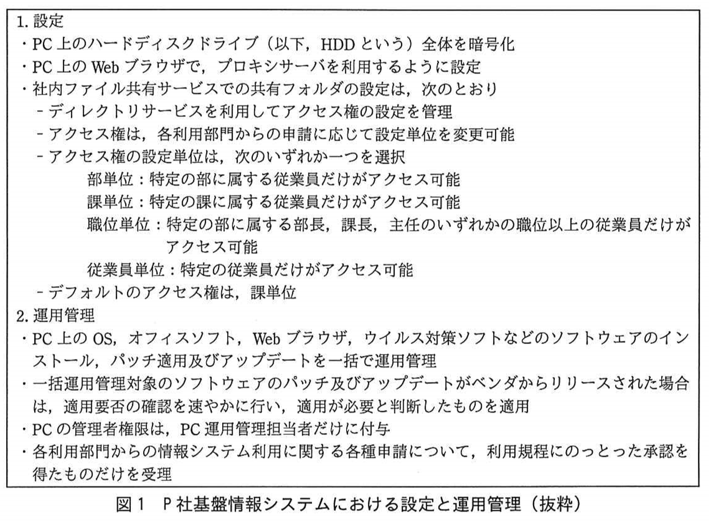

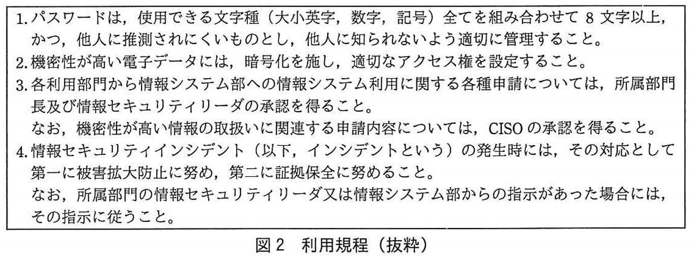

〔インシデントの発見と初動対応〕  
　9月26日(月)10時，運用管理課のHさんが基盤情報システムを運用監視していたところ，9月23日(金)20時から25日(日)にかけての社内からインターネットへの通信量が前週の金曜日から日曜日にかけてのものと比較して大幅に増えていることを発見し，直ちに運用管理課のD課長に報告した．D課長は不審に思い，プロキシサーバのログを調査するようHさんに指示した．その結果，図3に示すことが判明した．

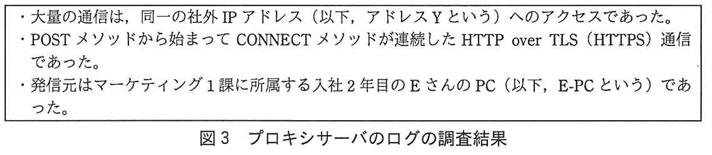

　D課長はその旨をC部長に報告の上，B課長に連絡した．連絡を受けたB課長は利用規程にのっとり，<u>①Eさんに初動対応を指示</u>し，併せてA部長に報告した．  
　B課長は，自席のPCを利用してEさんの ~~a1~~ を調査した．Eさんは市場調査業務を担当しているので，P社の競合情報，消費者動向などについての様々なインターネット上のWebサイトを日々閲覧している．次に情報システム部の協力の下，B課長による調査結果とE-PCから ~~a2~~ へのアクセスログとを突き合わせたところ，大量の通信が記録されていた時刻の中には，Eさんが ~~a3~~ 時刻が含まれていた．さらに，Eさんへの聞き取り調査を行ったところ，Eさんは，P社が入居するオフィスビルの法定点検に基づく停電時以外は離席，外出又は帰宅の際，E-PCにログインしたままにしていたことが判明した．これらのことから，今回の不審なアクセスは，Eさん自身によるものではないと推定された．  
　B課長とD課長による協議の結果，同日15時に，情報システム部による調査及び対応が開始された．情報システム部における調査の結果を図4に，各事象の発生日時を表1に示す．

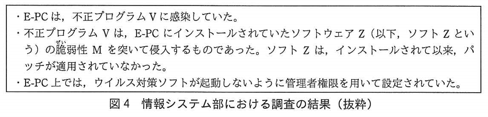

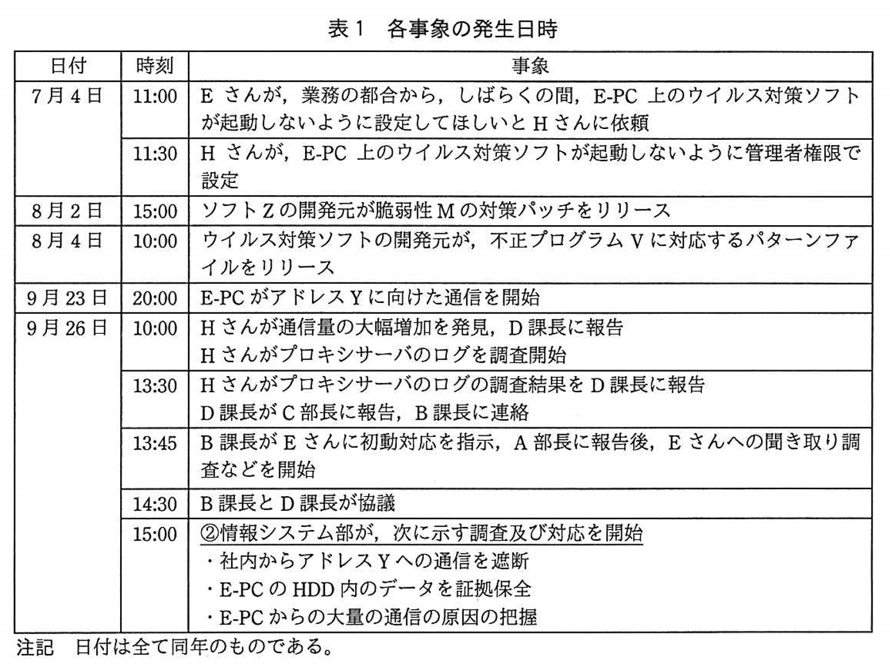

〔情報システム部による調査結果の中間報告〕  
　情報システム部によるE-PCの調査結果の中間報告が，9月27日(火)13時から行われた．次は，その時のD課長とB課長の会話である．  

|    |    |
|:---|:---|
| D課長：| マーケティング部と情報システム部の間では，ソフトZに対するパッチ適用を含めた運用管理について何も取決めがない状態でした．マーケティング部からのソフトウェアインストール申請書には，パッチ適用などの運用管理についての依頼は記載されていませんでした．|
| B課長：| すみません，依頼内容が不十分でしたね．|
| D課長：| 他にもこれらと同じようなことがあったら問題なので，引き続き調査をします．ところで，7月4日から昨日までのログ中の通信先を解析したところ，ウイルス対策ソフトの開発元などによって悪意あるWebサイトと判断されたURL又はIPアドレスに該当するものはありませんでした．感染原因は，電子メールの添付ファイルやUSBメモリからと考えられますが，もし，感染原因がインターネット上のWebサイトへのアクセスだとしたら，Eさんがアクセスしたのは，閲覧するだけで不正プログラムに感染するように，企業の ~~b~~ の公開Webサイトが ~~c~~ されたものだったとも考えられます．|
| B課長：| ~~b~~ のURLということであれば，悪意あるWebサイトだとは思わないので，防ぎようがないですね．Webサイトが ~~c~~ されたことによって，そのWebサイトの所有者たる企業は ~~d~~ となるだけでなく，Webサイト閲覧者に対しても不正プログラムによる被害が及ぶので，~~e~~ の立場になってしまうおそれがあり，非常に怖いですね．<u>③私自身の職務からも人ごとではないので，すぐに対策を検討しましょう．D課長，協力をお願いします</u>．

〔課題の改善〕  
　内容が不明なデータがE-PCから社外に大量に送信されたことから，~~f~~ が起きたおそれもあるとB課長は考えた．そこでEさんにヒアリングした．その結果，マーケティング2課へのヒアリングも必要と考えられたので，マーケティング2課のプレゼントキャンペーン担当を務めているG主任にもヒアリングを行った．それらの結果を図5に示す．

　B課長は，A部長にこれまでの調査結果の報告を行うとともに，図6に示す項目の検討が必要であると進言した．  

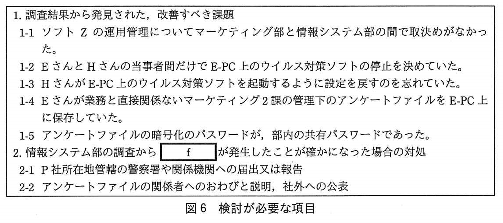

　B課長は，社内関係者の協力を得て課題の改善を実施した．また，中間報告以降の情報システム部の調査結果からfが発生したおそれは低いことが分かった．  
　B課長は，改善すべき課題が図6の1-1から1-5の他にもないかの確認をA部長に提案し，了承を得た．  
　B課長は，改善すべき課題が他にもないか，~~g~~ を実施した．その結果，他の課題が発見され，マーケティング部内で改善策の検討が開始された．  
　A部長は，マーケティング部内での他の課題の発見に至ったB課長の提案を高く評価した．発見された課題とその改善策をA部長がP社経営陣に報告したところ，これらの提案は，全社的な改善活動に発展した．  

**設問1**〔インシデントの発見と初動対応〕について，(1)～(3)に答えよ．

**(1)** 本文中の下線①について，次の(i)～(v)のうち，B課長がEさんに指示すべき初動対応だけを全て挙げた組合せを，解答群の中から選べ．

|   |   |
|:--|:--|
| (i) | E-PCのHDD内のフォルダとファイルに対して何も操作をしない．|
| (ii) | E-PCの電源を強制切断し，かつ，電源ケーブルを電源コンセントから外す．|
| (iii) | E-PCをLANから切り離す．|
| (iv) | E-PCを再起動する．|
| (v) | E-PCを使ってEさんの基盤情報システムへのログインパスワードを変更する．|

解答群

| | | | | | |
|:---|:---|:---|:---|:---|:---|
| ア |(i)| イ |(i)，(iii)| ウ |(i)，(iv)，(v)|
| エ |(ii)，(iii)| オ |(ii)，(v)| カ |(iii)，(iv)，(v)|
| キ |(iii)，(v)| ク |(iv)，(v)|

**正解：イ**

B課長がEさんに指示すべき初動対応としては，図２の4.にあるとおり，第一に被害拡大防止，第二に証拠保全です．これに選択肢をあてはめると，被害拡大防止には(iii)の「LANからの切り離し」が，証拠保全には(i)の「何も操作しない」が合致します．よって(i)(iii)が正解です．  
(ii)の「電源切断」は被害拡大防止の効果はありますが，揮発性の情報が失われますので証拠保全に違反します．  
(iv)の「再起動|も揮発性の情報が失われますので証拠保全に違反します．  
(v)の「E-PCによるログインパスワード変更|は被害を拡大させるおそれがあります．  

**(2)** 本文中の ~~a1~~ ～ ~~a3~~ に入れる字句の組合せはどれか．aに関する解答群のうち，最も適切なものを選べ．

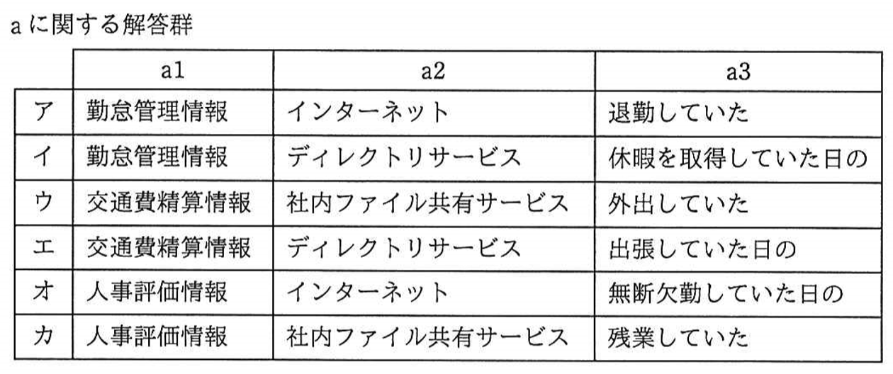

**正解：ａーア**

~~a1~~ には「勤怠管理情報」「交通費精算情報」「人事評価情報」のいずれかがあてはまりますが，空欄のある文だけでは判断できません．後続の説明にある「調査結果と～アクセスログを突き合わせる」という記述から，時系列の連続した情報である「勤怠管理情報」があてはまるとわかります．    
~~a2~~ は「インターネット上のWebサイトを日々閲覧している～アクセスログを突き合わせる」という記述から，外部あての「インターネット」だと分かり，~~a3~~ は「退勤していた」となります．  
「交通費精算情報」「人事評価情報」は時系列の連続した情報ではなく，「ディレクトリサービス」「社内ファイル共有サービス」は内部あてのアクセスですので，あてはりません．

**(3)** 表1中の下線②について，次の(i)～(v)のうち，該当する作業だけを全て挙げた組合せを，解答群の中から選べ．

|   |   |
|:--|:--|
|(i)| E-PCのHDDを別のHDDにフルコピーし，その別のHDDを"秘密"とラベルに書いた資料保存用紙封筒に入れ，封印し，Eさんが管理するマーケティング部の鍵付きロッカーに保管 |
|(ii)| E-PCのHDDを別のHDDにフルコピーした上で，最新のパターンファイルを搭載した別のPCに，その別のHDDを接続してフルスキャンを実施 |
|(iii)| アドレスYへの通信をプロキシサーバで遮断し，ファイアウォールではインターネットへの通信のうち，プロキシサーバを経由しないものだけを許可 |
|(iv)| 他の作業に先駆けて最初にE-PCにOS及びアプリケーションのクリーンインストールを実施した上で，E-PCをEさんに返却 |
|(v)| プロキシサーバなどのネットワーク機器上のログとE-PC上のイベントログなどを時系列に沿って整理及び分析 |

解答群

| | | | | | |
|:---|:---|:---|:---|:---|:---|
| ア |(i)| イ |(i)，(iii)，(v)| ウ |(i)，(iv)|
| エ |(ii)| オ |(ii)，(iii)，(iv)| カ |(ii)，(v)|
| キ |(iii)，(iv)| ク |(iii)，(v)| ケ |(iv)，(v)|

**正解：カ**

情報システム部が開始した対応である「Yへの通信の遮断」「HDDのデータを証拠保全」「通信原因の把握」に該当する作業を選ぶ問題です．  
(i)と(ii) の「E-PCのHDDを別のHDDにフルコピー」が「HDDのデータを証拠保全」にあたりますが，(i)の「その別のHDDを"秘密"とラベルに書いた資料保存用紙封筒に入れ，封印し，Eさんが管理するマーケティング部の鍵付きロッカーに保管」はEさんが過って，あるいは故意に利用してしまう可能性があり，不適切です．  
(ii)の「最新のパターンファイルを搭載した別のPCに，その別のHDDを接続してフルスキャンを実施」は「通信原因の把握」として適切です．  
(iii)の「アドレスYへの通信をプロキシサーバで遮断」は「Yへの通信の遮断」に該当しますが，「ファイアウォールではインターネットへの通信のうち，プロキシサーバを経由しないものだけを許可」は「プロキシサーバを経由しないインターネット接続はファイアウォールによって遮断」という記述と矛盾しますので誤りです．  
(iv)の「OS及びアプリケーションのクリーンインストール」は「HDDのデータを証拠保全」になりませんので不適切です．  
(v)の「ログとイベントログなどを時系列に沿って整理及び分析」は「通信原因の把握」にあてはまります．  
よって，(ii)と(v)が該当します．

**設問2**〔情報システム部による調査結果の中間報告〕について，(1)，(2)に答えよ．

**(1)** 本文中のb～eに入れる字句はどれか．解答群のうち，最も適切なものを選べ．

b，c に関する解答群

| | | | | | |
|:---|:---|:---|:---|:---|:---|
| ア | 改ざん | イ | 偽装 | ウ | 正規 |
| エ | 設計 | オ | 非正規 | カ | ボット化 |

**正解：ｂ－ウ ｃ－ア**

「企業の ~~b~~ の公開Webサイトが ~~c~~ されたものだったとも考えられます」と「~~b~~ のURLということであれば，悪意あるWebサイトだとは思わない」という記述から「URLが疑わしくない」ことがわかります．よって，~~b~~ には「正規」が当てはまります．  
すると，「閲覧するだけで不正プログラムに感染するように，企業の正規の公開Webサイトが ~~c~~ されたものだった」となり，~~c~~ には「改ざん」が当てはまります．なお，URLは正しいことから「偽装」は当てはまりません．また，外部からの指示によって動作したという記述はありませんので「ボット化」も当てはまりません．

d，e に関する解答群

| | | | | | |
|:---|:---|:---|:---|:---|:---|
| ア | 加害者 | イ | 首謀者 | ウ | 助言者 |
| エ | 扇動者 | オ | 第三者 | カ | 被害者 |

**正解：ｄ－カ ｅ－ア**

「Webサイトが改ざんされたことによって，そのWebサイトの所有者たる企業は ~~d~~ となる」という記述より，~~d~~ には「被害者」が当てはまります．  
「Webサイト閲覧者に対しても不正プログラムによる被害が及ぶので，~~e~~ の立場になってしまう」という記述より，~~e~~ には「加害者」が当てはまります．  

**(2)** 本文中の下線③について，B課長とD課長はどのような対策を検討したか．解答群のうち，最も適切なものを選べ．

解答群

|    |    |
|:---|:---|
| ア | 自社Webサイトのアクセシビリティを見直し，自社Webサイトの閲覧者に対する利便性と安全性を確保することによって，自社のブランドイメージの向上を図る． |
| イ | 自社Webサイトの改ざんを防ぐために，自社Webサーバを情報システム部に依頼して速やかに停止させ，自社Webサーバを社外のパブリッククラウド上に移行し，他者とのリスク共有(リスク移転)を図る． |
| ウ | 自社Webサイトの脆弱性検査を定期的に実施して，問題があれば修正する．また，新たな脆弱性が発見された場合にも必要な対応をとる． |
| エ | 自社Webサイトのトップページ上において，重要なお知らせとして，自社Webサイトにドライブバイダウンロードが仕掛けられた可能性があると公表し，自社Webサイトの閲覧者に対して注意を喚起する． |

**正解：ウ**

下線部③は，B課長の「私自身の職務からも人ごとではないので，すぐに対策を検討しましょう．D課長，協力をお願いします」というD課長への依頼ですから，今回のインシデントについて，自社が被害者ではなく加害者になってしまう危険性を防ぐ方策があてはまります．よって，自社サイトの脆弱性対策が該当します．  
アの「**アクセシビリティ**（11.1.4参照）向上」はこの方策には該当しません．  
イの「社外の **パブリッククラウド**（3.1.2参照）上への移行」はリスク共有（**リスク移転**（10.1.1参照））が可能ですが，セキュリティの低下が懸念されるため，改ざん防止対策としては適切ではありません．  
エについては，**ドライブバイダウンロード**（1.1.9参照）が仕掛けられた可能性があるのは自社サイトだとは特定されていないので誤りです．  

**設問3**〔課題の改善〕について，(1)～(3)に答えよ．

**(1)** 本文中及び図6中のfに入れる字句はどれか．解答群のうち，最も適切なものを選べ．

f に関する解答群

|   |   |   |   |
|:--|:--|:--|:--|
| ア | E-PCへのDDoS攻撃 | イ | E-PCへの辞書攻撃 |
| ウ | E-PCへの総当たり攻撃 | エ | 情報改ざん |
| オ | 情報破壊 | カ | 情報漏えい |

**正解：ｆ－カ**

本文の「内容が不明なデータがE-PCから社外に大量に送信されたことから，~~f~~ が起きたおそれもある」という記述と，図６の「~~f~~ が発生した場合の対処」に「アンケートファイルの関係者へのおわび」があることから，社内における被害ではなく，社外に悪影響を与えるインシデントだとわかります．回答群の中で，これに該当するのは「情報漏えい」のみです．  
E-PCへの **DDoS攻撃**（1.1.9参照），E-PCへの **辞書攻撃**（1.1.9参照），E-PCへの **総当たり攻撃**（1.1.9参照），情報改ざん，情報破壊はすべて，社内における被害に該当します．  

**(2)** 図5中の下線④について，社内共有フォルダNのアクセス権の設定単位はどのようになっていたと考えられるか．解答群のうち，最も適切なものを選べ．

解答群

|   |   |   |   |   |   |   |   |
|:--|:--|:--|:--|:--|:--|:--|:--|
| ア | 課単位 | イ | 従業員単位 | ウ | 職位単位 | エ | 部単位 |

**正解：エ**

Eさんはマーケティング部のマーケティング１課に所属しており，このファイルは同じ部のマーケティング２課が作成したファイルと考えられます．よって，社内共有フォルダNのアクセス権の設定は部単位だったと考えられます．

**(3)** 本文中の ~~g~~ に入れる字句はどれか．解答群のうち，最も適切なものを選べ．

g に関する解答群

| | |
|:---|:---|
| ア |  情報システムのうち，マーケティング部内の従業員が利用しているものに対し，脆弱性検査 |
| イ | マーケテイング部内で取り扱っている全ての情報資産とその取扱い状況を可視化した上で，リスクアセスメント |
| ウ | マーケティング部内で取り扱っている全てのファイルの所在と所有者を洗い出し，各ファイルのアクセス権限の見直し |
| エ | マーケテイング部における，E-PC以外でのウイルス対策ソフトを停止させたままのPC又はパッチ適用並びにアップデートが行われていないPCの有無の確認 |
| オ | マーケティング部における，E-PC以外でのソフトZがインストールされたPCの有無と利用状況の確認

**正解：ｇ－イ**

今回の調査結果から発見された改善すべき課題は「運用管理についての取り決めの欠落」「当事者間のみによるウイルス対策ソフトの停止」「ウイルス対策ソフトの復帰忘れ」「業務と無関係なファイルの保存」「パスワードの共有」であり，~~g~~ には，改善すべき課題がこれら以外にもないか確認するために実施することが入ります．よって，「マーケテイング部内で取り扱っている全ての情報資産とその取扱い状況の可視化」と「リスクアセスメント」が該当します．  
アの「情報システムの脆弱性検査」は情報システム部が行うべきことですので不適切です．  
ウの「所有者の洗い出し」は選択肢イの「マーケテイング部内で取り扱っている全ての情報資産とその取扱い状況の可視化」の一部で，範囲が限定されています．  
エの「ウイルス対策ソフトを停止させたままのPCの有無の確認」は既に挙げられた課題に含まれています．  
オの「ソフトZがインストールされたPCの有無と利用状況の確認」は既に挙げられた課題に含まれています．  
